# Kotlin教程

Kotlin 是一种在 Java 虚拟机上运行的静态类型编程语言，被称之为 Android 世界的 Swift，由 JetBrains 设计开发并开源。

Kotlin 可以编译成Java字节码，也可以编译成 JavaScript，方便在没有 JVM 的设备上运行。

在Google I/O 2017中，Google 宣布 Kotlin 成为 Android 官方开发语言。

 

**我的第一个** **Kotlin** **程序**

Kotlin 程序文件以 **.kt** 结尾，如：hello.kt 、app.kt。

**最简版**

```
package hello                                     // 可选的包头

fun main(args: Array<String>)  {                  // 包级可见的函数，接受一个字符串数组作为参数
  println("Hello World!")                         // 分号可以省略
}
```

**面向对象**

```
class Greeter(val name: String) {
  fun greet()  {
  	println("Hello, $name")
  }
}

fun main(args: Array<String>)  {
  Greeter("World!").greet()     // 创建一个对象不用 new 关键字
}
```


**为什么选择Kotlin**？

​             简洁: 大大减少样板代码的数量。

​             安全: 避免空指针异常等整个类的错误。

​             互操作性: 充分利用 JVM、Android 和浏览器的现有库。

​             工具友好: 可用任何 Java IDE 或者使用命令行构建。

 

## **参考链接**

​           [官方网站](http://www.kotlinlang.org/)

​           [官方示例](http://try.kotlinlang.org/)

​           [官方网站 - 中文翻译](https://www.kotlincn.net/)

​           [Kotlin 官方在线工具](https://play.kotlinlang.org/)

 

## **Kotlin IntelliJ IDEA环境搭建**

IntelliJ IDEA 免费的社区版下载地址：https://www.jetbrains.com/idea/download/index.html

下载安装后，我们就可以使用该工具来创建项目，创建过程需要选择 SDK， Kotlin 与 JDK 1.6+ 一起使用。

在右侧的下拉菜单中勾选 Kotlin (Java) 复选框。

 

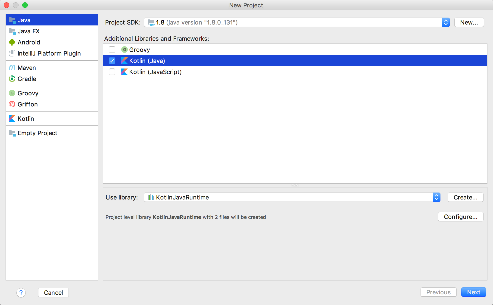


接下来我们取一个项目名:HelloWorld


项目创建完后，文件结构如下，跟 Java 的还是很类似的。

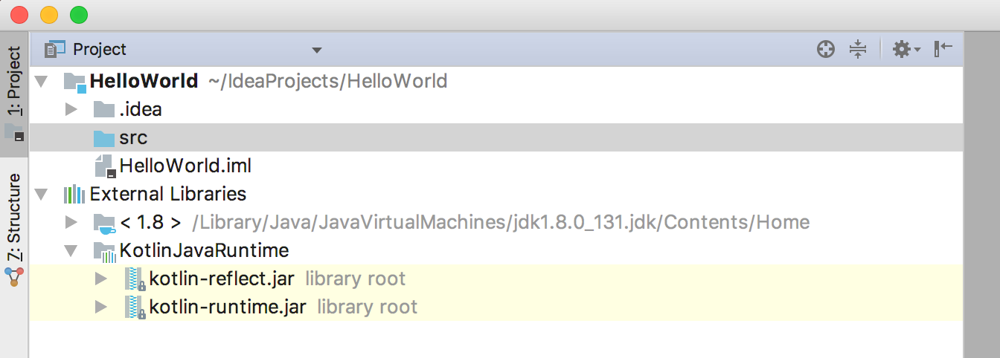


接下来 我们点击 src 文件夹，创建一个 Kotlin 文件，它可以任意命名，这里我们创建 app.kt

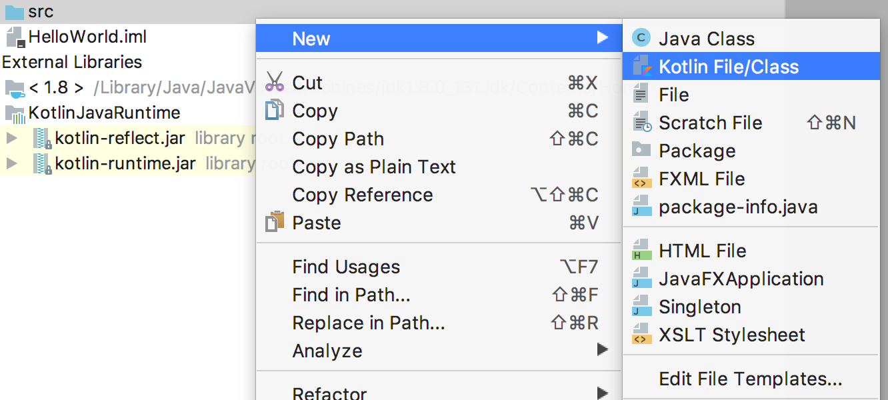


接下来，我们在 app.kt 文件中写点代码。IntelliJ IDEA 为我们提供了一个快速完成此操作的模板，只需键入 main 然后按 Tab 即可。


 

现在我们添加一行代码来打印出"Hello, World!"吧。


接下来我们可以鼠标点击编辑器左上角 kotlin图标并选择 Run 'AppKt'来运行代码：

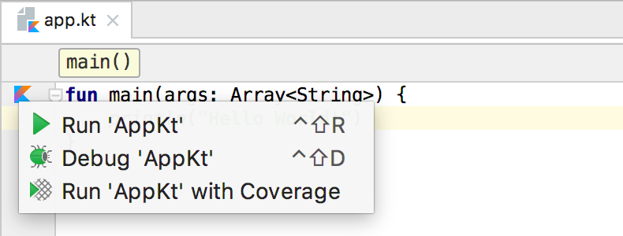


运行成功后就可以在窗口 Run 中看到结果。


这样我们第一个 Kotlin 代码就运行起来了。

 

## **Kotlin Eclipse** **环境搭建**

Eclipse 通过 [Marketplace](http://marketplace.eclipse.org/marketplace-client-intro?mpc_install=2257536) 安装 Kotlin 插件，打开 Eclipse，选择 Help -> Eclipse Marketplace… 菜单，搜索 Kotlin 插件：

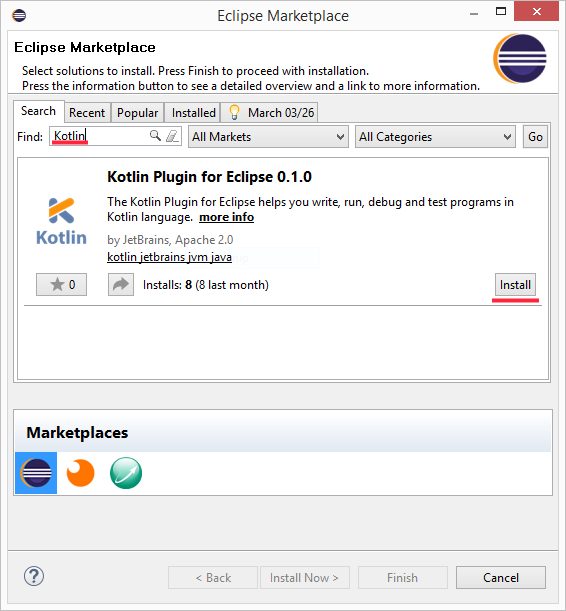


然后重启 Eclipse 选择 Window -> Open Perspective -> Other...，如果看到了 Kotlin 选项表明安装成功。

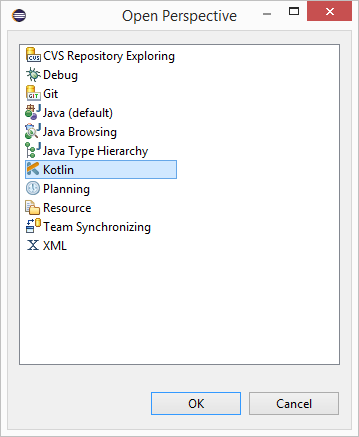


**创建新项目**

选择 File -> New -> Kotlin Project 来创建 Kotlin 项目：


创建成功后，项目结构如下：

 

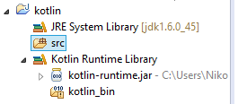

 


接下来 我们点击 src 文件夹，创建一个 Kotlin 文件，不用写 ".kt" ，默认自动添加，它可以任意命名，这里我们创建 hello

 


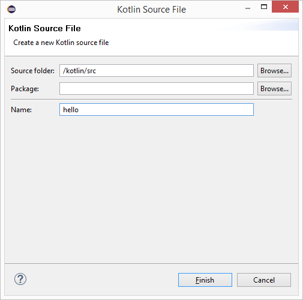


接下来，我们在 hello.kt 文件中写点代码。Eclipse 为我们提供了一个快速完成此操作的模板，只需键入 main 然后按 Enter 即可。

 

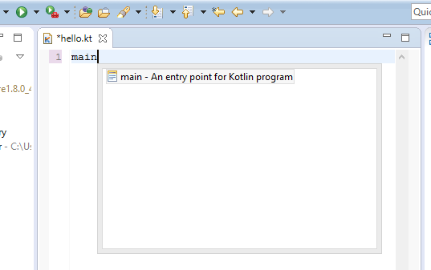


**运行应用**

接下来我们在 hello.kt 的编辑框内右击鼠标选择 Run As -> Kotlin Application 即可运行：


运行成功后就可以在窗口 Console 中看到结果。


这样我们第一个 Kotlin 代码就运行起来了。

 

## Kotlin 使用命令行编译

Kotlin 命令行编译工具下载地址：https://github.com/JetBrains/kotlin/releases/tag/v1.1.2-2，目前最新为 1.1.2-2。

你可以选择一个最新的稳定版下载。

下载完成后，解压到指定目录，然后将 **bin** 目录添加到系统环境变量。**bin** **目录包含编译和运行** **Kotlin** **所需的脚本**。

**SDKMAN!**

在 OS X、Linux、Cygwin、FreeBSD 和 Solaris 系统上也可以使用更简单的安装方法，命令如下：

```
$ curl -s https://get.sdkman.io | bash
 
$ sdk install kotlin
```

**Homebrew**

在 OS X 下，你可以使用 Homebrew 安装：

```
$ brew update
$ brew install kotlin
```

**MacPorts**

如果你是 MacPorts 用户，可以使用以下命令安装：

```
$ sudo port install kotlin
```

**创建和运行第一个程序**

创建一个名为 hello.kt 文件，代码如下：

**hello.kt**

```
fun main(args: Array<String>) { 
    println("Hello, World!") 
}
```


使用 Kotlin 编译器编译应用:

```
$ kotlinc hello.kt -include-runtime -d hello.jar
```

· **-d**: 用来设置编译输出的名称，可以是 class 或 .jar 文件，也可以是目录。

· **-include-runtime** : 让 .jar 文件包含 Kotlin 运行库，从而可以直接运行。

如果你想看所有的可用选项，运行:

```
$ kotlinc -help
```

运行应用

```
$ java -jar hello.jar
Hello, World!
```

**编译成库**

若需要将生成的 jar 包供其他 Kotlin 程序使用，可无需包含 Kotlin 的运行库：

```
$ kotlinc hello.kt -d hello.jar
```

由于这样生成的 .jar 文件不包含 Kotlin 运行库，所以你应该确保当它被使用时，运行时在你的 classpath 上。

你也可以使用 kotlin 命令来运行 Kotlin 编译器生成的 .jar 文件

```
$ kotlin -classpath hello.jar HelloKt
或
kotlin -cp hello.jar HelloKt
```

HelloKt 为编译器为 hello.kt 文件生成的默认类名。


## 运行 REPL（交互式解释器）

我们可以运行如下命令得到一个可交互的 shell，然后输入任何有效的 Kotlin 代码，并立即看到结果


## 使用命令行执行脚本

Kotlin 也可以作为一个脚本语言使用，文件后缀名为 .kts 。

例如我们创建一个名为 list_folders.kts，代码如下：

```
import java.io.File
 
val folders = File(args[0]).listFiles { // args是隐含参数，就像js 中的arguments
    file -> file.isDirectory() 
}

folders?.forEach { 
    folder -> println(folder) 
}
```

执行时通过 -script 选项设置相应的脚本文件。

```
$ kotlinc -script list_folders.kts <path_to_folder>
```

$ kotlinc -script list_folders.kts

 

## Kotlin Android 环境搭建

**安装 Kotlin 插件**

Android Studio 从 3.0（preview）版本开始将内置安装 Kotlin 插件。

打开 Settings ( Mac 为 Preferences) 面板，在右侧找到 Plugins 选项 (快捷键 Ctrl+, Mac 下为 command+)，搜索框输入 "Kotlin" 查找，点击 Search in repositories(仓库中搜索)，然后安装即可，安装完成之后需要重启 Android Studio。

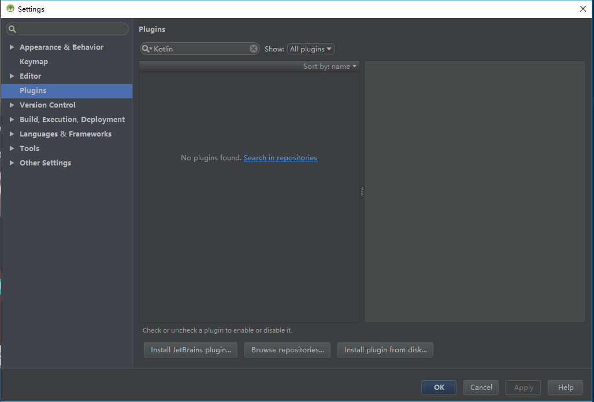

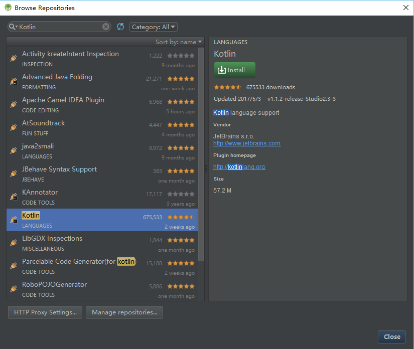


**创建新工程**

选择 Start a new Android Studio project 或者 File | New project，大多数选项均有默认值 ，只需要按几次"回车"键即可。


Android Studio 3.0 在当前对话框中提供启用 Kotlin 支持的选项，勾选后可以跳过 "配置 Kotlin 工程（Configuring Kotlin in the project）"的步骤。

选择 Android 版本:


 

选择需要创建的 Activity 样式:

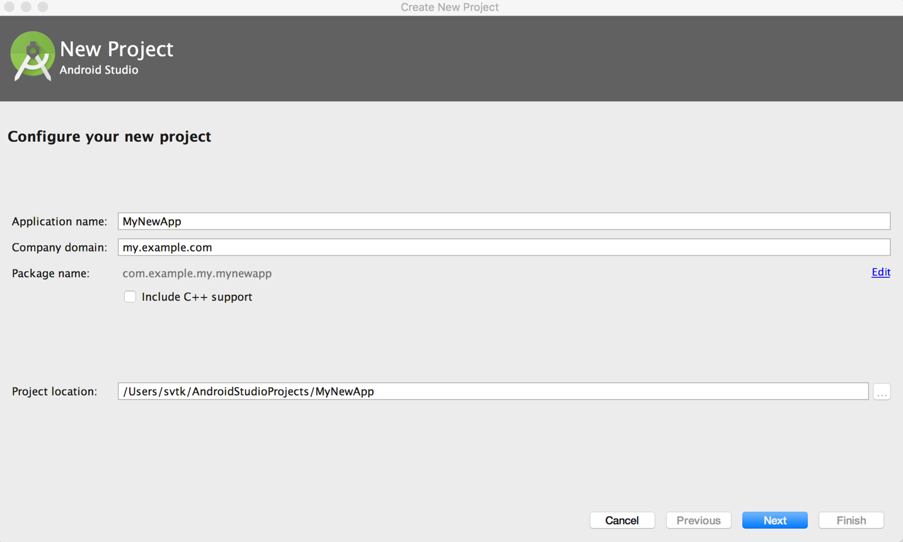


命名该 Activity:

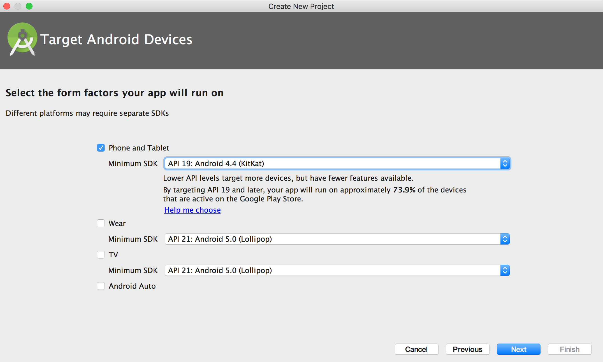

在 Android Studio 3.0 中，可以选择使用 Kotlin 创建 activity，因此也不需要"将Java 代码转换为 Kotlin（Converting Java code to Kotlin）"这一步骤。

早期版本中则会先使用 Java 创建 activity，然后再使用自动转换工具进行转换。


## **将Java代码转换为Kotlin**

重新打开Android Studio，新建一个Android项目吧，添加一个默认的MainActivity

打开 MainActivity.java 文件，通过菜单栏依次调出 Code | Convert Java File to Kotlin File：


转换完成后即可看到使用 Kotlin 编写的 activity。


**java 继承用 extends， kotlin 继承用冒号**


**工程中配置 Kotlin**

在开始编辑此文件时，Android Studio 会提示当前工程还未配置 Kotlin，根据提示完成操作即可，或者可以在菜单栏中选择 Tools

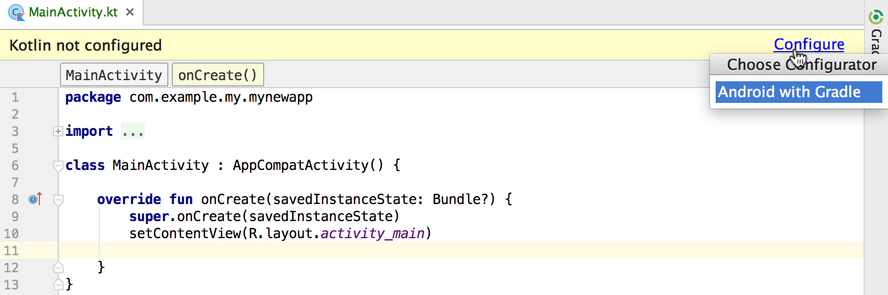

 

选择配置时有如下对话框，选择已安装的最新版本即可。


Kotlin 配置完成后，应用程序的 build.gradle 文件会更新。 你能看到新增了 apply plugin: 'kotlin-android' 及其依赖。


 

同步工程，在提示框中点击"立即同步（Sync Now）"或者使用 Sync Project with Gradle Files命令。


  

## **Kotlin** **基础语法**

Kotlin 文件以 .kt 为后缀。

**包声明**

代码文件的开头一般为包的声明：

```
package com.runoob.main

import java.util.*


fun test() {}

class Runoob {}
```


kotlin源文件不需要相匹配的目录和包，源文件可以放在任何文件目录。

以上例中 test() 的全名是 com.runoob.main.test、Runoob 的全名是 com.runoob.main.Runoob。

 

如果没有指定包，默认为 **default** 包。

**默认导入**

有多个包会默认导入到每个 Kotlin 文件中：

```
kotlin.*

kotlin.annotation.*

kotlin.collections.*

kotlin.comparisons.*

kotlin.io.*

kotlin.ranges.*

kotlin.sequences.*

kotlin.text.*
```

 

### **函数定义**

函数定义使用关键字 fun，参数格式为：`参数 : 类型` 

```
fun sum(a: Int, b: Int): Int {  // Int 参数，返回值 Int
  return a + b
}
```


表达式作为函数体，返回类型自动推断：

```
fun sum(a: Int, b: Int) = a + b

public fun sum(a: Int, b: Int): Int = a + b  // public 方法则必须明确写出返回类型
```

 

无返回值的函数(类似Java中的void)：

```
fun printSum(a: Int, b: Int): Unit { 
  print(a + b)
}
```

 

如果是返回 Unit类型，则可以省略(对于public方法也是这样)：

```
public fun printSum(a: Int, b: Int) { 
  print(a + b)
}
```


### 可变长参数函数

函数的变长参数可以用 **vararg** 关键字进行标识：

```
fun vars(vararg v: Int) {

  for (vt in v) {
    print(vt)
  }

}

// 测试
fun main(args: Array<String>) {

  vars(1, 2, 3, 4, 5) // 输出12345

}
```


### **lambda(匿名函数)**

lambda表达式使用实例：

```
// 测试
fun main(args: Array<String>) {

  val sumLambda: (Int, Int) -> Int = {x, y -> x + y}

  println(sumLambda(1, 2)) // 输出 3

}
```


### **定义常量与变量**

可变变量定义：var 关键字

```
var <标识符> : <类型> = <初始化值> 
```


不可变变量定义：val 关键字，只能赋值一次的变量(类似Java中final修饰的变量)

```
val <标识符> : <类型> = <初始化值>
```


**常量与变量都可以没有初始化值, 但是在引用前必须初始化**

 

编译器支持自动类型判断, 即声明时可以不指定类型,由编译器判断。

```
val a: Int = 1

val b = 1    // 系统自动推断变量类型为Int

val c: Int   // 如果不在声明时初始化则必须提供变量类型

c = 1        // 明确赋值


var x = 5    // 系统自动推断变量类型为Int

x += 1       // 变量可修改
```

 

### 注释

Kotlin 支持单行和多行注释，实例如下：

```
// 这是一个单行注释

 

/* 这是一个多行的
  块注释。 */
```


与 Java 不同, Kotlin 中的块注释允许嵌套。


 ### **字符串模板**

```
$ 表示一个变量名或者变量值

$varName 表示变量值

${varName.fun()} 表示变量的方法返回值:

var a = 1

// 模板中的简单名称：

val s1 = "a is $a"  

a = 2

// 模板中的任意表达式：

val s2 = "${s1.replace("is", "was")}, but now is $a"
```

 

**NULL检查机制（dart中使用一个！，kotlin中使用两个！！）**

**Kotlin的空安全设计对于声明可为空的参数，在使用时要进行空判断处理，有两种处理方式，字段后加** **!!** **像Java一样抛出空异常，另一种字段后加? 可不做处理返回值为null 或配合?:做空判断处理**

 

```
//类型后面加?表示可为空
var age: String? = "23" 

//抛出空指针异常
val ages = age!!.toInt()

//不做处理返回 null
val ages1 = age?.toInt()

//age为空返回-1（dart中使用 ??， kotlin中使用 ?:）
val ages2 = age?.toInt() ?: -1
```


**当一个引用可能为 null值时, 对应的类型声明必须明确地标记为可为 null。**

**当str中的字符串内容不是一个整数时, 返回null:**

 

```
fun parseInt(str: String): Int? {
 // ...
}
```

 

以下实例演示如何使用一个返回值可为 null 的函数:

```
fun main(args: Array<String>)  {

   if (args.size < 2) {
      print("Two integers expected")
      return
   }
   
   val x = parseInt(args[0])
   val y = parseInt(args[1])

   // 直接使用 `x * y` 会导致错误, 因为它们可能为 null.
   if (x != null && y != null) {
      // 在进行过 null 值检查之后, x 和 y 的类型会被自动转换为非 null变量
      // 也就是不用再使用！！
      print(x * y)
   }
}
```


**类型检测及自动类型转换**

**我们可以使用 is运算符检测一个表达式是否某类型的一个实例(类似于 Java中的 instanceof 关键字)。**

```
fun getStringLength(obj: Any): Int? {
   if (obj is String)  {
      // 做过类型判断以后，obj会被系统自动转换为String类型
      return obj.length
   }

 
   // 在这里还有一种方法，与Java中instanceof不同，使用!is
   //  if (obj !is String){
   //      // XXX
   // }

   // 这里的obj仍然是Any类型的引用
   
   return null

}
```


或者

 

```
fun getStringLength(obj: Any): Int? {

 if (obj !is String) {
    return null
 }

 // 在这个分支中, `obj` 的类型会被自动转换为 `String`
 return obj.length
}

```

 

甚至还可以

 

```
fun getStringLength(obj: Any): Int? {

  // 在 && 运算符的右侧, obj 的类型会被自动转换为 String
  if (obj is String && obj.length > 0) {
  	return obj.length 
  }

  return null
}
```

 

**区间**

区间表达式由具有操作符形式 **..** 的 rangeTo 函数辅以 in 和 !in 形成。

区间是为任何可比较类型定义的，但对于整型原生类型，它有一个优化的实现。以下是使用区间的一些示例:

 ```
 for (i in 1..4) print(i)//输出“1234”
 
 for (i in 4..1) print(i)//什么都不输出
 
  
 if (i in 1..10) {       //包含区间开头结尾（swift 里面有两个点和三个点之分）等同于 1 <= i && i <= 10
   println(i)
 }
 
 // 使用 step 指定步长
 for (i in 1..4 step 2) print(i)       // 输出“13”
 
 for (i in 4 downTo 1 step 2) print(i) // 输出“42”
                                       // i in 是一部分
                                       // 4 downTo 1 是一部分
                                       // step 2 是一部分
 
  
 
 // 使用 until 函数排除结束元素
 for (i in 1 until 10) {               // i in [1, 10) 排除了 10
    println(i)                         // swift 中使用三个点包含结尾，使用两个点不包含结尾
 }
 ```


**实例测试**

```
fun main(args: Array<String>) {

  print("循环输出：")
  for (i in 1..4) print(i)                   // 输出“1234”

  println("\n----------------")

  print("设置步长：")

  for (i in 1..4 step 2) print(i)            // 输出“13”

  println("\n----------------")

  print("使用 downTo：")

  for (i in 4 downTo 1 step 2) print(i)      // 输出“42”

  println("\n----------------")

  print("使用 until：")

  // 使用 until 函数排除结束元素

  for (i in 1 until 4) {                     // i in [1, 4) 排除了 4

    print(i)

  }

  println("\n----------------")

}
```


输出结果：

循环输出：1234

\----------------

设置步长：13

\----------------

使用 downTo：42

\----------------

使用 until：123

\----------------

 

**Kotlin** **基本数据类型**

Kotlin 的基本数值类型包括 Byte、Short、Int、Long、Float、Double 等。不同于 Java 的是，**字符不属于数值类型，是一个独立的数据类型。**

| **类型**  | **位宽度** |
| --------- | ---------- |
| Double    | 64         |
| Float     | 32         |
| Long      | 64         |
| Int       | 32         |
| **Short** | **16**     |
| Byte      | 8          |

 

**字面常量**

下面是所有类型的字面常量：

​           十进制：123

​           长整型以大写的 L 结尾：123L

​           16 进制以 0x 开头：0x0F

​           2 进制以 0b 开头：0b00001011

​           **注意：8进制不支持**

Kotlin 同时也支持传统符号表示的浮点数值：

​           Doubles 默认写法: 123.5, 123.5e10

​           Floats 使用 f 或者 F 后缀：123.5f

**你可以使用下划线使数字常量更易读：**

```
val oneMillion = 1_000_000

val creditCardNumber = 1234_5678_9012_3456L

val socialSecurityNumber = 999_99_9999L

val hexBytes = 0xFF_EC_DE_5E

val bytes = 0b11010010_01101001_10010100_10010010
```


**比较两个数字**

Kotlin 中没有基础数据类型，只有封装的数字类型，你每定义的一个变量，其实 Kotlin 帮你封装了一个对象，这样可以保证不会出现空指针。数字类型也一样，所以在比较两个数字的时候，就有比较数据大小和比较两个对象是否相同的区别了。

**在 Kotlin 中，三个等号 ===表示比较对象地址，两个 == 表示比较两个值大小**。 

```
fun main(args: Array<String>)  {

  val a: Int = 10000
  println(a === a)                          // true，值相等，对象地址相等

 

  //经过了装箱，创建了两个不同的对象
  val boxedA: Int? = a
  val anotherBoxedA: Int? = a

 
  //虽然经过了装箱，但是值是相等的，都是10000
  println(boxedA === anotherBoxedA)         // false，值相等，对象地址不一样
  println(boxedA == anotherBoxedA)          // true，值相等

}
```

 

**类型转换**

由于不同的表示方式，较小类型并不是较大类型的子类型，较小的类型不能隐式转换为较大的类型。 这意味着在不进行显式转换的情况下我们不能把 Byte 型值赋给一个 Int 变量。

 ```
 val b: Byte = 1           // OK, 字面值是静态检测的
 val i: Int = b            // 错误
 ```


我们可以代用其toInt()方法。

```
val b: Byte = 1           // OK, 字面值是静态检测的
val i: Int = b.toInt()    // OK
```

 

**每种数据类型都有下面的这些方法，可以转化为其它的类型：**

```
toByte(): Byte

toShort(): Short

toInt(): Int

toLong(): Long

toFloat(): Float

toDouble(): Double

toChar(): Char
```

 

有些情况下也是可以使用自动类型转化的，前提是可以根据上下文环境推断出正确的数据类型而且数学操作符会做相应的重载。例如下面是正确的：

```
val l = 1L + 3         // Long + Int => Long
```


**位操作符**

对于 Int 和 Long 类型，还有一系列的位操作符可以使用，分别是：

```
shl(bits) – 左移位 (Java’s <<)

shr(bits) – 右移位 (Java’s >>)

ushr(bits) – 无符号右移位 (Java’s >>>)

and(bits) – 与

or(bits) – 或

xor(bits) – 异或

inv() – 反向
```

 

**字符**

**和  Java 不一样，Kotlin 中的 Char 不能直接和数字操作，Char 必需是单引号 '** 包含起来的。比如普通字符 '0'，'a'。

 ```
 fun check(c: Char) {
   if (c == 1) { // 错误：类型不兼容
     // ……
   }
 }
 ```


字符字面值用单引号括起来: '1'。 特殊字符可以用反斜杠转义。 支持这几个转义序列：\t、 \b、\n、\r、\'、\"、\\ 和 \$。 编码其他字符要用 Unicode 转义序列语法：'\uFF00'。

 

我们可以显式把字符转换为 Int 数字： 

```
fun decimalDigitValue(c: Char): Int {
    if (c !in '0'..'9') {                               // c !in xxx, 而不是 ！ c in xxx
        throw IllegalArgumentException("Out of range")
    }
    return c.toInt() - '0'.toInt()                      // 显式转换为数字
}
```

 

当需要可空引用时，像数字、字符会被装箱。装箱操作不会保留同一性。

 

**布尔**

布尔用 Boolean 类型表示，它有两个值：true 和 false。

若需要可空引用布尔会被装箱。

内置的布尔运算有：

||          – 短路逻辑或

&&        – 短路逻辑与

!             - 逻辑非

 

**数组**

数组用类 Array 实现，并且还有一个 size 属性及 get 和 set 方法，由于使用 [] 重载了 get 和 set 方法，所以我们可以通过下标很方便的获取或者设置数组对应位置的值。

数组的创建两种方式：一种是使用函数arrayOf()；另外一种是使用工厂函数。如下所示，我们分别是两种方式创建了两个数组：

```
fun main(args: Array<String>)  {

    // [1,2,3]
    val a = arrayOf(1, 2, 3)

    // [0,2,4]
    val b = Array(3, {i -> (i * 2)})

    // 读取数组内容
    println(a[0])  // 输出结果：1
    println(b[1])  // 输出结果：2

}
```


**如上所述，[]运算符代表调用成员函数get()和set()。**

注意: 与 Java 不同的是，Kotlin 中数组是不协变的（invariant）。**⚠️**

 

除了类Array，还有ByteArray, ShortArray, IntArray，用来表示各个类型的数组，省去了装箱操作，因此效率更高，其用法同Array一样： 

```
val x: IntArray = intArrayOf(1, 2, 3)
x[0] = x[1] + x[2]
```


**字符串**

**和** **Java一样，String 是不可变的。方括号 [] 语法可以很方便的获取字符串中的某个字符，也可以通过 for 循环来遍历**：

```
for (c in str)  {
  println(c)
} 
```

 

**Kotlin** **支持三个引号** **"""** **扩起来的字符串，支持多行字符串**，比如：

```
fun main(args: Array<String>)  {

  val text = """
  多行字符串
  多行字符串
  """

  println(text)                  // 输出有一些前置空格
}
```


**String** **可以通过** **trimMargin()** **方法来删除多余的空白。**

```
  fun main(args: Array<String>)  {
  
  val text = """
  |多行字符串
  |菜鸟教程
  |多行字符串
  |Runoob
  """.trimMargin()

  println(text)  // 前置空格删除了
} 
```

默认 | 用作边界前缀，但你可以选择其他字符并作为参数传入，比如 trimMargin(">")。

 

### 字符串模板

字符串可以包含模板表达式 ，即一些小段代码，会求值并把结果合并到字符串中。 模板表达式以美元符（$）开头，由一个简单的名字构成:

 ```
 fun main(args: Array<String>) {
   val i = 10
   val s = "i = $i" // 求值结果为 "i = 10"
   println(s)
 } 
 ```

或者用花括号扩起来的任意表达式:

```
fun main(args: Array<String>) {

  val s = "runoob"

  val str = "$s.length is ${s.length}" 

  // 求值结果为 "runoob.length is 6"

  println(str)

}
```


原生字符串和转义字符串内部都支持模板。 如果你需要在原生字符串中表示字面值 $ 字符（它**不支持反斜杠转义**），你可以用下列语法(三引号+字符串模板语法)：

```
fun main(args: Array<String>) {
  val price = """${'$'}9.99"""
  println(price) // 求值结果为 $9.99
}
```

  

### Kotlin 条件控制

#### IF 表达式

一个 if 语句包含一个布尔表达式和一条或多条语句。

```
// 传统用法
var max = a 
if (a < b) {
   max = b
}
 
// 使用 else 
var max: Int
if (a > b) {
    max = a
} else {
    max = b
}
 
// 作为表达式(Dart 也有这种骚操作)
val max = if (a > b) a else b
```

我们也可以把 IF 表达式的结果赋值给一个变量。

```
val max = if (a > b) {
    print("Choose a")
    a
} else {
    print("Choose b")
    b
}
```

**这也说明我也不需要像Java那种有一个三元操作符，因为我们可以使用它来简单实现：**

```
val c = if (condition) a else b // Dart 里面也有这种骚操作
```

实例

```
fun main(args: Array<String>) {
    var x = 0
    if (x>0) {
        println("x 大于 0")
    } else if (x==0) {
        println("x 等于 0")
    } else {
        println("x 小于 0")
    }
 
    var a = 1
    var b = 2
    val c = if (a>=b) a else b
    println("c 的值为 $c")
}
```

输出结果为：

```
x 等于 0
c 的值为 2
```

#### 使用区间

使用 in 运算符来检测某个数字是否在指定区间内，区间格式为 **x..y** ：

实例

```
fun main(args: Array<String>) {
    val x = 5
    val y = 9
    if (x in 1..8) {
        println("x 在区间内")
    }
}
```

输出结果为：

```
x 在区间内
```

#### **When表达式**

**when** **将它的参数和所有的分支条件顺序比较，直到某个分支满足条件。**

**when** **既可以被当做表达式使用也可以被当做语句使用。如果它被当做表达式，符合条件的分支的值就是整个表达式的值，如果当做语句使用，则忽略个别分支的值。**

**when** **类似其他语言的** **switch** **操作符。其最简单的形式如下：**

```
when (x) {
    1 -> print("x == 1")
    2 -> print("x == 2")
    else -> { // 注意这个块
        print("x 不是 1 ，也不是 2")
    }
}
```

**在** **when** 中，else同 switch的default。如果其他分支都不满足条件将会求值else **分支。**

**如果很多分支需要用相同的方式处理，则可以把多个分支条件放在一起，用逗号分隔：**

```
when (x) {
    0, 1 -> print("x == 0 or x == 1")
    else -> print("otherwise")
}
```

我们也可以检测一个值在（in）或者不在（!in）一个区间或者集合中：

```
when (x) {
    in 1..10 -> print("x is in the range")
    in validNumbers -> print("x is valid")
    !in 10..20 -> print("x is outside the range")
    else -> print("none of the above")
}
```

**另一种可能性是检测一个值是（is）或者不是（!is）一个特定类型的值。注意：** **由于智能转换，你可以访问该类型的方法和属性而无需任何额外的检测。**

```
fun hasPrefix(x: Any) = when(x) {
    is String -> x.startsWith("prefix")
    else -> false
}
```

**when也可以用来取代 if-else if链。如果不提供参数（when的参数），所有的分支条件都是简单的布尔表达式，而当一个分支的条件为真时则执行该分支：**

```
when {
    x.isOdd() -> print("x is odd")
    x.isEven() -> print("x is even")
    else -> print("x is funny")
}
```

实例

```
fun main(args: Array<String>) {
    var x = 0
    when (x) {
        0, 1 -> println("x == 0 or x == 1")
        else -> println("otherwise")
    }
 
    when (x) {
        1 -> println("x == 1")
        2 -> println("x == 2")
        else -> { // 注意这个块
            println("x 不是 1 ，也不是 2")
        }
    }
 
    when (x) {
        in 0..10 -> println("x 在该区间范围内")
        else -> println("x 不在该区间范围内")
    }
}
```

输出结果：

```
x == 0 or x == 1
x 不是 1 ，也不是 2
x 在该区间范围内
```

when 中使用 **in** 运算符来判断集合内是否包含某实例：

```
fun main(args: Array<String>) {
    val items = setOf("apple", "banana", "kiwi")
    when {
        "orange" in items -> println("juicy")
        "apple" in items -> println("apple is fine too")
    }
}
```

输出结果：

```
apple is fine too
```

  

### Kotlin 循环控制

#### For 循环

for 循环可以对任何提供迭代器（iterator）的对象进行遍历，语法如下:

```
for (item in collection) {
  print(item)
}
```

循环体可以是一个代码块:

```
for (item: Int in ints) {
    // ……
}
```

如上所述，for 可以循环遍历任何提供了迭代器的对象。

如果你想要通过索引遍历一个数组或者一个 list，你可以这么做：

```
for (i in array.indices) {
    print(array[i])
}
```

注意这种"在区间上遍历"会编译成优化的实现而不会创建额外对象。

或者你可以用库函数 withIndex：

```
for ((index, value) in array.withIndex()) {
    println("the element at $index is $value")
}
```

实例

对集合进行迭代：

```
fun main(args: Array<String>) {
    val items = listOf("apple", "banana", "kiwi")
    for (item in items) {
        println(item)
    }
 
    for (index in items.indices) {
        println("item at $index is ${items[index]}")
    }
}
```

输出结果：

```
apple
banana
kiwi
item at 0 is apple
item at 1 is banana
item at 2 is kiwi
```

#### while 与 do...while 循环

while是最基本的循环，它的结构为：

```
while(布尔表达式) {
  //循环内容
}
```

do…while 循环 对于 while 语句而言，如果不满足条件，则不能进入循环。但有时候我们需要即使不满足条件，也至少执行一次。

do…while 循环和 while 循环相似，不同的是，do…while 循环至少会执行一次。

```
do {
  //代码语句
} while(布尔表达式);
```

实例

```
fun main(args: Array<String>) {
    println("----while 使用-----")
    var x = 5
    while (x > 0) {
        println( x--)
    }
    println("----do...while 使用-----")
    var y = 5
    do {
        println(y--)
    } while(y>0)
}
```

输出结果：

```
5
4
3
2
1
----do...while 使用-----
5
4
3
2
1
```


### 返回和跳转

Kotlin 有三种结构化跳转表达式：

· *return*。默认从最直接包围它的函数或者匿名函数返回。

· *break*。终止最直接包围它的循环。

· *continue*。继续下一次最直接包围它的循环。

在循环中 Kotlin 支持传统的 break 和 continue 操作符。

```
fun main(args: Array<String>) {
    for (i in 1..10) {
        if (i==3) {
            continue  // i 为 3 时跳过当前循环，继续下一次循环
        }
        println(i)
        if (i>5) {
            break   // i 为 6 时 跳出循环
        }
    }
}
```

输出结果：

```
1
2
4
5
6
```


#### Break 和 Continue 标签

在 Kotlin 中任何表达式都可以用标签（label）来标记。 标签的格式为标识符后跟 @ 符号，例如：abc@、fooBar@都是有效的标签。 要为一个表达式加标签，我们只要在其前加标签即可。

```
loop@ for (i in 1..100) {
    // ……
}
```

现在，我们可以用标签限制 break 或者continue：

```
loop@ for (i in 1..100) {
    for (j in 1..100) {
        if (……) {
            break@loop
        }
    }
}
```

标签限制的 break 跳转到刚好位于该标签指定的循环后面的执行点。 continue 继续标签指定的循环的下一次迭代。

 

#### 标签处返回

Kotlin 有函数字面量、局部函数和对象表达式。因此 Kotlin 的函数可以被嵌套。 标签限制的 return 允许我们从外层函数返回。 最重要的一个用途就是从 lambda 表达式中返回。回想一下我们这么写的时候：

```
fun foo() {
    ints.forEach {
        if (it == 0) {
          return
        }
        print(it)
    }
}
```

这个 return 表达式从最直接包围它的函数即 foo 中返回。 （注意，这种非局部的返回只支持传给内联函数的 lambda 表达式。） 如果我们需要从 lambda 表达式中返回，我们必须给它加标签并用以限制 return。

```
fun foo() {
    ints.forEach lit@ {
        if (it == 0) return@lit
        print(it)
    }
}
```

现在，它只会从 lambda 表达式中返回。通常情况下使用隐式标签更方便。 该标签与接受该 lambda 的函数同名。

```
fun foo() {
    ints.forEach {                     // 大括号
        if (it == 0) {
            return@forEach
        }
        print(it)
    }
}
```

或者，我们用一个匿名函数替代 lambda 表达式。 匿名函数内部的 return 语句将从该匿名函数自身返回

```
fun foo() {
    ints.forEach(fun(value: Int) {     // 小括号 
        if (value == 0) {
            return
        }
        print(value)
    })
}
```

当要返一个回值的时候，解析器优先选用标签限制的 return，即

```
return@a 1
```

意为"从标签 @a 返回 1"，而不是"返回一个标签标注的表达式 (@a 1)"。

正常循环：

```
for (i in 1..4) print(i) // 打印结果为: "1234"
```

如果你需要按反序遍历整数可以使用标准库中的 downTo() 函数:

```
for (i in 4 downTo 1) { // i in 是一部分，4 downTo 1 是另一部分
    print(i) // 打印结果为: "4321"
}
```

也支持指定步长：

```
for (i in 1..4 step 2) {         // i in 是一部分， 1..4 是第二部分， step 2 是第三部分
    print(i) // 打印结果为: "13"
}
 
for (i in 4 downTo 1 step 2) {   // i in 是一部分， 4 downTo 1 是一部分， step 2 是另一部分
    print(i) // 打印结果为: "42"
}
```

如果循环中不要最后一个范围区间的值可以使用 until 函数:

```
for (i in 1 until 10) { // i in [1, 10), 不包含 10
     println(i)         // swift 中使用 ..、... 分别代表开区间和闭区间 
} 
```

#  

### Kotlin 类和对象

#### 类定义

Kotlin 类可以包含：构造函数和初始化代码块、函数、属性、内部类、对象声明。

Kotlin 中使用关键字 **class** 声明类，后面紧跟类名：

```
// 类名为 Runoob
class Runoob {
    // 大括号内是类体构成
}
```

我们也可以定义一个空类：

```
class Empty
```

可以在类中定义成员函数：

```
class Runoob() {
    fun foo() { print("Foo") } // 成员函数
}
```


#### 类的属性

属性定义

类的属性可以用关键字 **var** 声明为可变的，否则使用只读关键字 **val** 声明为不可变。

```
class Runoob {
    var name: String = ……
    var url: String = ……
    var city: String = ……
}
```

我们可以像使用普通函数那样使用构造函数创建类实例：

```
val site = Runoob() // Kotlin 中没有 new 关键字， Java、 C++ 中有
```

要使用一个属性，只要用名称引用它即可

```
site.name           // 使用 . 号来引用
site.url
```

Kotlin 中的类可以有一个 主构造器，以及一个或多个次构造器，**主构造器是类头部的一部分，位于类名称之后**:

```
class Person constructor(firstName: String) {}
```

**如果主构造器没有任何注解，也没有任何可见度修饰符，那么constructor关键字可以省略**。

```
class Person(firstName: String) {}
```

#### getter 和 setter

属性声明的完整语法：

```
var <propertyName>[: <PropertyType>] [= <property_initializer>]
    [<getter>]
    [<setter>]
```

**getter** **和** **setter** **都是可选**

**如果属性类型可以从初始化语句或者类的成员函数中推断出来，那就可以省去类型，val不允许设置setter函数，因为它是只读的。**

```
var allByDefault: Int? // 错误: 需要一个初始化语句, 默认实现了 getter 和 setter 方法
var initialized = 1    // 类型为 Int, 默认实现了 getter 和 setter
val simple: Int?       // 类型为 Int ，默认实现 getter ，但必须在构造函数中初始化
val inferredType = 1   // 类型为 Int 类型,默认实现 getter
```

实例

以下实例定义了一个 Person 类，包含两个可变变量 lastName 和 no，lastName 修改了 getter 方法，no 修改了 setter 方法。

```
class Person {
 
    var lastName: String = "zhang"
        get() = field.toUpperCase()   // 将变量赋值后转换为大写， field 关键字
        set
 
    var no: Int = 100
        get() = field                // 后端变量
        set(value) {
            if (value < 10) {        // 如果传入的值小于 10 返回该值
                field = value
            } else {
                field = -1           // 如果传入的值大于等于 10 返回 -1
            }
        }
 
    var height: Float = 145.4f
        private set
}
 
// 测试
fun main(args: Array<String>) {
    var person: Person = Person()
 
    person.lastName = "wang"
 
    println("lastName:${person.lastName}")
 
    person.no = 9
    println("no:${person.no}")
 
    person.no = 20
    println("no:${person.no}")
 
}
```

输出结果为：

```
lastName:WANG
no:9
no:-1
```

Kotlin 中类不能有字段。提供了 Backing Fields (后端变量) 机制, 备用字段使用 field 关键字声明, field 关键词只能用于属性的访问器，如以上实例：

```
var no: Int = 100
        get() = field                // 后端变量
        set(value) {
            if (value < 10) {        // 如果传入的值小于 10 返回该值
                field = value
            } else {
                field = -1           // 如果传入的值大于等于 10 返回 -1
            }
        }
```

非空属性必须在定义的时候初始化, kotlin 提供了一种可以延迟初始化的方案,使用 **lateinit**（Dart 中用 late） 关键字描述属性：

```
public class MyTest {
    lateinit var subject: TestSubject
 
    @SetUp fun setup() {
        subject = TestSubject()
    }
 
    @Test fun test() {
        subject.method()  // dereference directly
    }
}
```


#### 主构造器

主构造器中不能包含任何代码，初始化代码可以放在初始化代码段中，初始化代码段使用 init 关键字作为前缀。

```
class Person constructor(firstName: String) {
    init {
        println("FirstName is $firstName")
    }
}
```

注意：主构造器的参数可以在初始化代码段中使用，也可以在类主体定义的属性初始化代码中使用。 一种简洁语法，可以通过主构造器来定义属性并初始化属性值（可以是var或val）：

```
class People(val firstName: String, val lastName: String) {
    //...
}
```

**如果构造器有注解，或者有可见度修饰符，这时constructor关键字是必须的，注解和修饰符要放在它之前。**

实例

创建一个 Runoob类，并通过构造函数传入网站名：

```
class Runoob constructor(name: String) {  // 类名为 Runoob
    // 大括号内是类体构成
    var url: String = "http://www.runoob.com"
    var country: String = "CN"
    var siteName = name
 
    init {
        println("初始化网站名: ${name}")
    }
 
    fun printTest() {
        println("我是类的函数")
    }
}
 
fun main(args: Array<String>) {
    val runoob =  Runoob("菜鸟教程")
    println(runoob.siteName)
    println(runoob.url)
    println(runoob.country)
    runoob.printTest()
}
```

输出结果为：

```
初始化网站名: 菜鸟教程
菜鸟教程
http://www.runoob.com
CN
我是类的函数
```


#### 次构造函数

类也可以有二级构造函数，需要加前缀 constructor:

```
class Person {
    // 放在里面的是二级构造函数
    constructor(parent: Person) {
        parent.children.add(this) 
    }
}
```

**如果类有主构造函数，每个次构造函数都要，或直接或间接通过另一个次构造函数代理主构造函数。在同一个类中代理另一个构造函数使用this 关键字：**

```
class Person(val name: String) {
    constructor (name: String, age: Int) : this(name) {
        // 初始化...
    }
}
```

如果一个非抽象类没有声明构造函数(主构造函数或次构造函数)，它会产生一个没有参数的构造函数。构造函数是 public 。**如果你不想你的类有公共的构造函数**，你就得声明一个空的主构造函数

```
class DontCreateMe private constructor () {
}
```

*注意：在* *JVM* 虚拟机中，如果主构造函数的所有参数都有默认值，编译器会生成一个附加的无参的构造函数，这个构造函数会直接使用默认值。这使得Kotlin可以更简单的使用像 Jackson 或者 JPA 这样使用无参构造函数来创建类实例的库。

```
class Customer(val customerName: String = "")
```

实例

```
class Runoob constructor(name: String) {  // 类名为 Runoob
    // 大括号内是类体构成
    var url: String = "http://www.runoob.com"
    var country: String = "CN"
    var siteName = name
 
    init {
        println("初始化网站名: ${name}")
    }
 
    // 次构造函数
    constructor (name: String, alexa: Int) : this(name) {
        println("Alexa 排名 $alexa")
    }
 
    fun printTest() {
        println("我是类的函数")
    }
}
 
fun main(args: Array<String>) {
    val runoob =  Runoob("菜鸟教程", 10000)
    println(runoob.siteName)
    println(runoob.url)
    println(runoob.country)
    runoob.printTest()
}
```

输出结果为：

```
初始化网站名: 菜鸟教程
Alexa 排名 10000
菜鸟教程
http://www.runoob.com
CN
我是类的函数
```


#### 抽象类

抽象是面向对象编程的特征之一，类本身，或类中的部分成员，都可以声明为 abstract 的。抽象成员在类中不存在具体的实现。

注意：无需对抽象类或抽象成员标注 open 注解。

```
open class Base {
    open fun f() {}
}
 
abstract class Derived : Base() { // 基类后面要有一个圆括号
    override abstract fun f()
}
```


#### 嵌套类

我们可以把类嵌套在其他类中，看以下实例：

```
class Outer {                  // 外部类
    private val bar: Int = 1
    
    class Nested {             // 嵌套类
        fun foo() = 2
    }
}
 
fun main(args: Array<String>) {
    val demo = Outer.Nested().foo() // 调用格式：外部类.嵌套类.嵌套类方法/属性
    println(demo)                   // == 2， outer 后面没有圆扣号
}
```


#### 内部类

内部类使用 inner 关键字来表示。（内部类有 inner 标识符， 嵌套类没有inner 标识符）

内部类会带有一个对**外部类的对象**的引用（与嵌套类的区别），所以内部类可以访问外部类成员属性和成员函数。

```
class Outer {
    private val bar: Int = 1
    var v = "成员属性"
    
    /**嵌套内部类**/
    inner class Inner {
        fun foo() = bar            // 访问外部类成员
        fun innerTest() {
            var o = this@Outer     //获取外部类的成员变量！！！！！！！！！！！！！
            println("内部类可以引用外部类的成员，例如：" + o.v)
        }
    }
}
 
fun main(args: Array<String>) {
    val demo = Outer().Inner().foo() // 注意，这里 Outer 后面有圆括号
    println(demo) //   1
    val demo2 = Outer().Inner().innerTest()   
    println(demo2)   // 内部类可以引用外部类的成员，例如：成员属性
}
```

**为了消除歧义，要访问来自外部作用域的 this，我们使用this@label，其中 @label 是一个 代指 this 来源的标签。**


#### 匿名内部类

使用对象表达式来创建匿名内部类：

```
class Test {
    var v = "成员属性"
 
    fun setInterFace(test: TestInterFace) {
        test.test()
    }
}
 
/**
 * 定义接口
 */
interface TestInterFace {
    fun test()
}
 
fun main(args: Array<String>) {
    var test = Test()
 
    /**
     * 采用对象表达式来创建接口对象，即匿名内部类的实例。
     */
    test.setInterFace(object : TestInterFace {
        override fun test() {
            println("对象表达式创建匿名内部类的实例")
        }
    })
}
```


#### 类的修饰符

类的修饰符包括 classModifier 和_accessModifier_:

```
·      classModifier: 类属性修饰符，标示类本身特性。
·      abstract    // 抽象类  
·      final       // 类不可继承，默认属性
·      enum        // 枚举类
·      open        // 类可继承，类默认是final的
·      annotation  // 注解类
·      accessModifier: 访问权限修饰符
·      private    // 仅在同一个文件中可见
·      protected  // 同一个文件中或子类可见
·      public     // 所有调用的地方都可见
·      internal   // 同一个模块中可见
```

实例

```
·      // 文件名：example.kt
·      package foo
·       
·      private fun foo() {} // 在 example.kt 内可见
·       
·      public var bar: Int = 5 // 该属性随处可见
```


### Kotlin 继承

**Kotlin** **中所有类都继承该** **Any** **类，它是所有类的超类，对于没有超类型声明的类是默认超类**：

```
class Example // 从 Any 隐式继承
```

Any 默认提供了三个函数：

```
equals()
 
hashCode()
 
toString()
```

**注意：Any 不是java.lang.Object。**

**如果一个类要被继承，可以使用** **open** **关键字进行修饰。**

```
open class Base(p: Int)           // 定义基类
 
class Derived(p: Int) : Base(p)
```


#### 构造函数

##### 子类有主构造函数

**如果子类有主构造函数，** **则基类必须在主构造函数中立即初始化。**

```
open class Person(var name : String, var age : Int) {// 基类在主构造函数中初始化
 
}
 
class Student(name : String, age : Int, var no : String, var score : Int) : Person(name, age) {
 
}
 
// 测试
fun main(args: Array<String>) {
    val s =  Student("Runoob", 18, "S12346", 89)
    println("学生名： ${s.name}")
    println("年龄： ${s.age}")
    println("学生号： ${s.no}")
    println("成绩： ${s.score}")
}
```

输出结果：

```
学生名： Runoob
年龄： 18
学生号： S12346
成绩： 89
```


##### 子类没有主构造函数

**如果子类没有主构造函数，则必须在每一个二级构造函数中用** **super** **关键字初始化基类，或者在代理另一个构造函数。初始化基类时，可以调用基类的不同构造方法。**

```
class Student : Person {
 
    constructor(ctx: Context) : super(ctx) {
    } 
 
    constructor(ctx: Context, attrs: AttributeSet) : super(ctx,attrs) {
    }
}
```

实例

```
/**用户基类**/
open class Person(name: String) {
    /**次级构造函数**/
    constructor(name: String, age: Int): this(name){
        //初始化
        println("-------基类次级构造函数---------")
    }
}
 
/**子类继承 Person 类**/
class Student: Person {
 
    /**次级构造函数**/
    constructor(name: String, age: Int, no: String, score: Int): super(name, age) {
        println("-------继承类次级构造函数---------")
        println("学生名： ${name}")
        println("年龄： ${age}")
        println("学生号： ${no}")
        println("成绩： ${score}")
    }
}
 
fun main(args: Array<String>) {
    var s =  Student("Runoob", 18, "S12345", 89)
}
```

输出结果：

```
-------基类次级构造函数---------
-------继承类次级构造函数---------
学生名： Runoob
年龄： 18
学生号： S12345
成绩： 89
```


##### 重写

**在基类中，使用fun声明函数时，此函数默认为final修饰，不能被子类重写。如果允许子类重写该函数，那么就要手动添加open 修饰它, 子类重写方法使用** **override** **关键词：**

```
/**用户基类**/
open class Person {
    open fun study() {       // 允许子类重写
        println("我毕业了")
    }
}
 
/**子类继承 Person 类**/
class Student : Person() {
 
    override fun study(){    // 重写方法
        println("我在读大学")
    }
}
 
fun main(args: Array<String>) {
    val s =  Student()
    s.study();
 
}
```

输出结果为:

```
我在读大学
```

如果有多个相同的方法（继承或者实现自其他类，如A、B类），则必须要重写该方法，使用super范型去选择性地调用父类的实现。

```
open class A {
    open fun f () { print("A") }
    fun a() { print("a") }
}
 
interface B {
    fun f() { print("B") } //接口的成员变量默认是 open 的
    fun b() { print("b") }
}
 
class C() : A(), B {       //这里一个细节，类的继承使用了圆括号，但是接口的继承没有使用圆括号
    override fun f() {
        super<A>.f()       //调用 A.f()
        super<B>.f()       //调用 B.f()
    }
}
 
fun main(args: Array<String>) {
    val c =  C()
    c.f();
 
}
```

C 继承自 a() 或 b(), C 不仅可以从 A 或者 B 中继承函数，而且 C 可以继承 A()、B() 中共有的函数。此时该函数在中只有一个实现，为了消除歧义，该函数必须调用A()和B()中该函数的实现，并提供自己的实现。

输出结果为:

```
AB
```


##### 属性重写

属性重写使用 override 关键字，属性必须具有兼容类型，每一个声明的属性都可以通过初始化程序或者getter方法被重写：

```
open class Foo {
    open val x: Int get { …… }
}
 
class Bar1 : Foo() {             // class 接口的继承使用的是圆括号，InterFace接口继承不使用圆括号
    override val x: Int = ……
}
```

**不能把var重写为val后面有解释**。因为val属性本身只定义了getter方法，重写为var属性会在衍生类中额外声明一个setter方法

你可以在主构造函数中使用 override 关键字作为属性声明的一部分:

```kotlin
interface Foo {                                // InterFace接口继承时不使用圆括号，class接口继承时使用圆括号
    val count: Int
}
 
class Bar1(override val count: Int) : Foo      // val属性被重写为了val，似乎没有什么作用
 
class Bar2 : Foo {
    override var count: Int = 0                // val属性被重写为了val属性

```


##### **几点补充：**

1、子类继承父类时，不能有跟父类同名的变量，除非父类中该变量为 private，或者父类中该变量为 open 并且子类用 override 关键字重写:

```
open class Person(var name: String, var age: Int) {    // 主构造函数中声明了两个成员变量
    open var sex: String = "unknow"    
    init {        
        println("基类初始化")    
    }
}
// 子类的主构造方法的 name 前边也加了 var，这是不允许的，会报'name' hides member of supertype and needs 'override' modifier
// 还要注意这里加了var或者val就是成员变量，否则就行临时变量
class Student(var name: String, age: Int, var no: String, var score: Int) : Person(name, age) {
    override var sex: String = "male"
}
```

如上代码片段中，子类 Student 主构造方法的第一个字段 name 前边加 var 关键字会报错。

2、子类不一定要调用父类和接口中共同拥有的同名的方法

引用文章中的话：“C 继承自 a() 或 b(), C 不仅可以从 A 或则 B 中继承函数，而且 C 可以继承 A()、B() 中共有的函数。此时该函数在中只有一个实现，为了消除歧义，该函数必须调用A()和B()中该函数的实现，并提供自己的实现。”

我试过了，不是必须调用 A() 和 B() 中该函数的实现，代码如下：

```
open class A {
    open fun f() {
        println("A")
    }
    fun a() {
        println("a")
    }
}
interface B {
    fun f() {
        println("B")
    }
    fun b() {
        println("b")
    }
}
class C : A(), B {              // 继承class接口需要使用圆括号，继承Interface接口不需要圆括号
    override fun f() {          // f方法在A， B接口中都有定义，这里对其进行重写了，而且完全抛弃了他们的实现
        // super<A>.f()
        // super<B>.f()
        println("C")
    }
}
```

如上代码片段，注释掉 **super<A>.f()** 和 **super<B>.f()** 也不报错。

3、关于子类不能用 val 重写父类中的 var，我的猜测是：子类重写父类属性，也就相当于必须重写该属性的 getter 和 setter 方法，而子类中的 val 不能有 setter 方法，所以无法“覆盖”父类中 var 的 setter 方法，相当于缩小了父类中相应属性的使用范围，是不允许的，**就像我们不能把父类中一个 public 方法重写成 private 方法一样**。

4、如果一个变量想要在定义的时候被初始化，则该变量必须拥有 backing field 字段，该变量的默认 getter 和 setter 方法中是有定义 field 字段的，但是如果我们重写了这个变量的 getter 方法和 setter 方法，并且在 getter 方法和 setter 方法中都没有出现过 filed 这个关键字，则编译器会报错，提示 Initializer is not allowed here because this property has no backing field，除非显式写出 filed 关键字（哪怕它什么都不干，只要放在那里就可以了，我理解是出现一次就相当于“声明”过了，就可以用了，而在定义变量的时候初始化是要求 field 被“声明”过才可以）：

```
var aaa: Int = 0
get() {
    field // 这里必须出现一下field关键字，否则 var aaa: Int = 0 会报错，除非你去掉 = 0这部分，不要给它赋初始化值
    return 0
}
set(value) {}
internal val baz = 6    // 相同模块内可见
```

 

### Kotlin接口

Kotlin 接口与 Java 8 类似，使用 interface 关键字定义接口，**允许方法有默认实现：**

```
interface MyInterface {    // open class 和 InterFace 两种接口
  fun bar()                // 未实现，方法要带上圆括号，但是不用带上分号
  fun foo() {              //已实现
      // 可选的方法体
      println("foo")
  }
}
```


#### **实现接口**

一个类或者对象可以实现一个或多个接口。

实例

```
interface MyInterface {
  fun bar()
  
  fun foo() {
    // 可选的方法体
    println("foo")
  }
}

class Child : MyInterface {        // Interface接口的实现不用使用圆括号
  override fun bar() {             // 重写父类中的方法，注意改方法在Interface中没有任何的修饰，因为Interface中默认就是open的
    // 方法体
    println("bar")
  }
}

fun main(args: Array<String>) {
  val c = Child()
  c.foo();
  c.bar();
}
```

输出结果为：

```
foo
bar
```


#### **接口中的属性**

**接口中的属性只能是抽象的，不允许初始化值，接口不会保存属性值，实现接口时，必须重写属性（但是方法允许有默认实现）：**

```
interface MyInterface {
  var name: String                       // InterFace接口中，方法可有默认实现，但是属性必须是抽象的
}

class MyImpl: MyInterface {
  override var name: String = "runoob" //重写属性
}
```


**实例**

```
interface MyInterface {
  var name: String //name 属性, 抽象的

  fun bar()
  fun foo() {
    // 可选的方法体
    println("foo")
  }
}

class Child : MyInterface {
  override var name: String = "runoob" // 重写属性

  override fun bar() {                 // 重写方法
    println("bar")
  }
}

fun main(args: Array<String>) {
  val c = Child()
  c.foo();
  c.bar();
  println(c.name)
}
```


输出结果为：

```
foo
bar
runoob
```

#### **函数重写**

实现多个接口时，可能会遇到同一方法继承多个实现的问题。例如:

**实例**

```
interface A {
    fun foo() {                      // 已实现
        print("A") 
    }  

    fun bar()                        // 未实现，没有方法体，是抽象的
}

interface B {
  fun foo() { 
      print("B")                      // 已实现
  }  
  fun bar() { 
      print("bar")                    // 已实现
  } 
}

class C: A {
  override fun bar() {                // 该方法在A中是抽象方法，必须被重写
      print("bar")
  }  
}

 

class D: A, B {
  override fun foo() {
    super<A>.foo()
    super<B>.foo()
  }

 
  override fun bar() {
    super<B>.bar()
  }
}

 

fun main(args: Array<String>) {
  val d = D()
  d.foo();
  d.bar();
}
```


输出结果为：

```
A
B
bar
```


实例中接口 A 和 B 都定义了方法 foo() 和 bar()， 两者都实现了 foo(), B 实现了 bar()。因为 C 是一个实现了 A 的具体类，所以必须要重写 bar() 并实现这个抽象方法。

然而，如果我们从 A 和 B 派生 D，我们需要实现多个接口继承的所有方法，并指明 D 应该如何实现它们。这一规则既适用于继承单个实现（bar()）的方法也适用于继承多个实现（foo()）的方法。


### Kotlin扩展

Kotlin 可以**对一个类的属性和方法进行扩展**，且不需要继承或使用 Decorator 模式。

扩展是一种静态行为，对被扩展的类代码本身不会造成任何影响。

 

**扩展函数**

扩展函数可以在已有类中添加新的方法，不会对原类做修改，扩展函数定义形式：

```
fun receiverType.functionName(params) {
  body
}
```

   receiverType：表示函数的接收者，也就是函数扩展的对象(被扩展的类类名)

   functionName：扩展函数的名称（添加的方法）

   params：扩展函数的参数，可以为NULL

   以上的例子为receiverType类添加了一个方法：functionName(params)


以下实例扩展 User 类 ：

```
class User(var name: String)    // 这个类有一个实例变量name

/**扩展函数，为类添加了一个实例方法**/
fun User.Print() {
  print("用户名 $name")
}

fun main(arg: Array<String>) { // Dart 中是 List<String>
  var user = User("Runoob")
  user.Print()
}
```

实例执行输出结果为：

```
用户名 Runoob
```


下面代码为 MutableList 添加一个swap 函数：

```
// 扩展函数 swap,调换不同位置的值
fun MutableList<Int>.swap(index1: Int, index2: Int) {
  // this 在实例方法中代表该实例对象
  val tmp = this[index1]
  this[index1] = this[index2]
  this[index2] = tmp
}

fun main(args: Array<String>) {
  val l = mutableListOf(1, 2, 3)
  // 位置 0 和 2 的值做了互换
  l.swap(0, 2)                   // 'swap()' 函数内的 'this' 将指向 'l' 的值
  println(l.toString())
}
```


实例执行输出结果为：

```
[3, 2, 1]
```

**this 关键字指代接收者对象(receiver object)(也就是调用扩展函数时, 在点号之前指定的类的实例)。**

 

**扩展函数是静态解析的**

扩展函数是静态解析的，并不是接收者类型的虚拟成员，在调用扩展函数时，具体被调用的的是哪一个函数，由调用函数的的对象表达式来决定的，而不是动态的类型决定的:

```
open class C

class D: C()

fun C.foo() = "c"  // 扩展函数 foo

fun D.foo() = "d"  // 扩展函数 foo

fun printFoo(c: C) {
  println(c.foo()) // 类型是 C 类, 调用的是 C 类型的 foo
}

fun main(arg: Array<String>) {
  printFoo(D())
}
```

实例执行输出结果为：

```
C
```


**若扩展函数和成员函数一致，则使用该函数时，会优先使用成员函数。**

```
class C {
    fun foo() {
        println("成员函数") 
    }
}

fun C.foo() { 
    println("扩展函数") 
}

fun main(arg:Array<String>){
  var c = C()
  c.foo()
}
```

实例执行输出结果为：

```
成员函数
```


**扩展一个空对象**

在扩展函数内， 可以通过 this 来判断接收者是否为 NULL,这样，即使接收者为 NULL,也可以调用扩展函数。例如:

```
fun Any?.toString(): String {

  if (this == null) {
      return "null"
  }

  // 空检测之后，“this”会自动转换为非空类型，所以下面的 toString()

  // 解析为 Any 类的成员函数
  // 下面实际是调用了 this.toString()
  return toString()

}

fun main(arg:Array<String>){
  var t = null
  println(t.toString())
}
```

实例执行输出结果为：

```
null
```


**扩展属性**

除了函数，Kotlin 也支持属性对属性进行扩展:

```
val <T> List<T>.lastIndex: Int

  get() = size - 1 // this.size - 1
```

**扩展属性允许定义在类或者 kotlin 文件中，不允许定义在函数中。初始化属性因为属性没有后端字段（backing field），所以不允许被初始化，只能由显式提供的getter/setter定义。**

```
val Foo.bar = 1 // 错误：扩展属性不能有初始化器
```

**扩展属性只能被声明为val。**


**伴生对象的扩展**

如果一个类定义有一个伴生对象 ，你也可以为伴生对象定义扩展函数和属性。

伴生对象通过"类名."形式调用伴生对象，伴生对象声明的扩展函数，通过用类名限定符来调用：

```
class MyClass {
  companion object { } // 将被称为 "Companion"
}

fun MyClass.Companion.foo() {
  println("伴随对象的扩展函数")
}

val MyClass.Companion.no: Int
  get() = 10

fun main(args: Array<String>) {
  println("no:${MyClass.no}")
  MyClass.foo()
}
```


实例执行输出结果为：

```
no:10
```

伴随对象的扩展函数

**扩展的作用域**

通常扩展函数或属性定义在顶级包下:

```
package foo.bar
fun Baz.goo() { …… } 
```

要使用所定义包之外的一个扩展, 通过import导入扩展的函数名进行使用:

```
package com.example.usage

import foo.bar.goo // 导入所有名为 goo 的扩展
 // 或者
import foo.bar.*  // 从 foo.bar 导入一切

fun usage(baz: Baz) {
  baz.goo()
}
```

 

**扩展声明为成员**

在一个类内部你可以为另一个类声明扩展。

在这个扩展中，有个多个隐含的接受者，其中扩展方法定义所在类的实例称为分发接受者，而扩展方法的目标类型的实例称为扩展接受者。

```
class D {
  fun bar() { println("D bar") }
}

class C {
  fun baz() { println("C baz") }
  fun D.foo() {
    bar()  // 调用 D.bar
    baz()  // 调用 C.baz
  }

  fun caller(d: D) {
    d.foo()  // 调用扩展函数
  }
}

fun main(args: Array<String>) {

  val c: C = C()
  val d: D = D()
  c.caller(d)
}
```

实例执行输出结果为：

```
D bar
C baz
```

在 C 类内，创建了 D 类的扩展。此时，C 被成为分发接受者，而 D 为扩展接受者。从上例中，可以清楚的看到，在扩展函数中，可以调用派发接收者的成员函数。

假如在调用某一个函数，而该函数在分发接受者和扩展接受者均存在，则以扩展接收者优先，要引用分发接收者的成员你可以使用限定的 this 语法。

```
class D {
  fun bar() { println("D bar") }
}

class C {
  fun bar() { println("C bar") } // 与 D 类 的 bar 同名

  fun D.foo() {
    bar()          // 调用 D.bar()，扩展接收者优先
    this@C.bar()   // 调用 C.bar()
  }
  
  fun caller(d: D) {
    d.foo()        // 调用扩展函数
  }
}

fun main(args: Array<String>) {
  val c: C = C()
  val d: D = D()
  c.caller(d)
}
```

实例执行输出结果为：

```
D bar
C bar
```


以成员的形式定义的扩展函数, 可以声明为 open , 而且可以在子类中覆盖. 也就是说, 在这类扩展函数的派 发过程中, 针对分发接受者是虚拟的(virtual), 但针对扩展接受者仍然是静态的。

```
open class D {}

class D1 : D() {}

open class C {
  open fun D.foo() {
    println("D.foo in C")
  }

  open fun D1.foo() {
    println("D1.foo in C")
  }

  fun caller(d: D) {
    d.foo()  // 调用扩展函数
  }
}

class C1 : C() {
  override fun D.foo() {
    println("D.foo in C1")
  }

  override fun D1.foo() {
    println("D1.foo in C1")
  }
}
 
fun main(args: Array<String>) {
  C().caller(D())  // 输出 "D.foo in C"
  C1().caller(D()) // 输出 "D.foo in C1" —— 分发接收者虚拟解析
  C().caller(D1()) // 输出 "D.foo in C" —— 扩展接收者静态解析
}
```

实例执行输出结果为：

```
D.foo in C

D.foo in C1

D.foo in C
```


 伴生对象内的成员相当于 Java 中的静态成员，其生命周期伴随类始终，在伴生对象内部可以定义变量和函数，这些变量和函数可以直接用类名引用。
对于伴生对象扩展函数，有两种形式，一种是在类内扩展，一种是在类外扩展，这两种形式扩展后的函数互不影响（甚至名称都可以相同），即使名称相同，它们也完全是两个不同的函数，并且有以下特点：

​             （1）类内扩展的伴随对象函数和类外扩展的伴随对象可以同名，它们是两个独立的函数，互不影响；

​             （2）当类内扩展的伴随对象函数和类外扩展的伴随对象同名时，类内的其它函数优先引用类内扩展的伴随对象函数，即对于类内其它成员函数来说，类内扩展屏蔽类外扩展；

​             （3）类内扩展的伴随对象函数只能被类内的函数引用，不能被类外的函数和伴随对象内的函数引用；

​             （4）类外扩展的伴随对象函数可以被伴随对象内的函数引用，；

例如以下代码：

```
  class MyClass {

        companion object {
          val myClassField1: Int = 1
          var myClassField2 = "this is myClassField2"

          fun companionFun1() {
            println("this is 1st companion function.")
            foo()
          }

          fun companionFun2() {
            println("this is 2st companion function.")
            companionFun1()
          }
        }

        fun MyClass.Companion.foo() {
          println("伴随对象的扩展函数（内部）")
        }

        fun test2() {
          MyClass.foo()
        }

        init {
          test2()
        }
  }

  val MyClass.Companion.no: Int
      get() = 10

  fun MyClass.Companion.foo() {
      println("foo 伴随对象外部扩展函数")
  }

  fun main(args: Array<String>) {
        println("no:${MyClass.no}")
        println("field1:${MyClass.myClassField1}")
        println("field2:${MyClass.myClassField2}")
        MyClass.foo()
        MyClass.companionFun2()
  }
```


运行结果：


````
      no:10

      field1:1

      field2:this is myClassField2

      foo 伴随对象外部扩展函数

      this is 2st companion function.

      this is 1st companion function.

      foo 伴随对象外部扩展函数
````


## Kotlin数据类与密封类

**数据类**

Kotlin 可以创建一个只包含数据的类，关键字为 **data**：

```
data class User(val name: String, val age: Int)     // 有两个实例变量
```

编译器会自动的从主构造函数中根据所有声明的属性提取以下函数：

- equals() / hashCode()

- toString(): 格式如 "User(name=John, age=42)"

- componentN(): functions 对应于属性，按声明顺序排列

- copy() 函数

如果这些函数在类中已经被明确定义了，或者从超类中继承而来，就不再会生成。


为了保证生成代码的一致性以及有意义，数据类需要满足以下条件：

- 主构造函数至少包含一个参数。
- 所有的主构造函数的参数必须标识为val 或者 var ;（也就是说在主构造函数中直接定义初始化实例变量）
- 数据类不可以声明为 abstract, open, sealed 或者 inner;
- 数据类不能继承其他类 (但是可以实现接口)。

**复制**

复制使用 copy() 函数，我们可以使用该函数复制对象并修改部分属性, 对于上文的 User 类，其实现会类似下面这样：

```
fun copy(name: String = this.name, age: Int = this.age) = User(name, age)
```


**实例**

使用 copy 类复制 User 数据类，并修改 age 属性:

```kotlin
data class User(val name: String, val age: Int)

fun main(args: Array<String>) {
  val jack = User(name = "Jack", age = 1)
  val olderJack = jack.copy(age = 2)              // 调用数据类实例的copy方法时，可以省略部分构造函数参数 
  println(jack)
  println(olderJack)
}
```

输出结果为：

```
User(name=Jack, age=1)
User(name=Jack, age=2)
```


**数据类以及解构声明**

组件函数允许数据类在解构声明中使用：

```
val jane = User("Jane", 35)
val (name, age) = jane                  // 类似于js中的解构赋值，但一律使用圆括号包围接收变量
println("$name, $age years of age")     // prints "Jane, 35 years of age"
```


**标准数据类**

标准库提供了 **Pair** 和 **Triple** 。在大多数情形中，命名数据类是更好的设计选择，因为这样代码可读性更强而且提供了有意义的名字和属性。

 

**密封类**

密封类用来表示受限的类继承结构：当一个值为有限几种的类型, 而不能有任何其他类型时。在某种意义上，他们是枚举类的扩展：枚举类型的值集合也是受限的，但每个枚举常量只存在一个实例，而密封类的一个子类可以有可包含状态的多个实例。

声明一个密封类，使用 **sealed** 修饰类，密封类可以有子类，但是所有的子类都必须要内嵌在密封类中。

sealed 不能修饰 interface, abstract class(会报 warning, 但是不会出现编译错误)

```
sealed class Expr

data class Const(val number: Double) : Expr()

data class Sum(val e1: Expr, val e2: Expr) : Expr()

object NotANumber : Expr()

fun eval(expr: Expr): Double = when (expr) {
  is Const -> expr.number
  is Sum -> eval(expr.e1) + eval(expr.e2)
  NotANumber -> Double.NaN
}
```


使用密封类的关键好处在于使用 when 表达式 的时候，如果能够 验证语句覆盖了所有情况，就不需要为该语句再添加一个 else 子句了。

```
fun eval(expr: Expr): Double = when(expr) {
  is Expr.Const -> expr.number
  is Expr.Sum -> eval(expr.e1) + eval(expr.e2)
  Expr.NotANumber -> Double.NaN
  // 不再需要 `else` 子句，因为我们已经覆盖了所有的情况
}
```





我的理解密封类就是一种专门用来配合 when 语句使用的类，举个例子，假如在 Android 中我们有一个 view，我们现在想通过 when 语句设置针对 view 进行两种操作：显示和隐藏，那么就可以这样做：

```
sealed class UiOp {
     object Show: UiOp()
     object Hide: UiOp()
} 

fun execute(view: View, op: UiOp) = when (op) {
     UiOp.Show -> view.visibility = View.VISIBLE
     UiOp.Hide -> view.visibility = View.GONE
}
```


以上功能其实完全可以用枚举实现，但是如果我们现在想加两个操作：水平平移和纵向平移，并且还要携带一些数据，比如平移了多少距离，平移过程的动画类型等数据，用枚举显然就不太好办了，这时密封类的优势就可以发挥了，例如：


```
sealed class UiOp {
    object Show: UiOp()
    object Hide: UiOp()
    class TranslateX(val px: Float): UiOp()
    class TranslateY(val px: Float): UiOp()
}

      
fun execute(view: View, op: UiOp) = when (op) {
    UiOp.Show -> view.visibility = View.VISIBLE
    UiOp.Hide -> view.visibility = View.GONE
    is UiOp.TranslateX -> view.translationX = op.px 
    // 这个 when 语句分支不仅告诉 view 要水平移动，还告诉 view 需要移动多少距离，这是枚举等 Java 传统思想不容易实现的
    is UiOp.TranslateY -> view.translationY = op.px
}
```


以上代码中，TranslateX 是一个类，它可以携带多于一个的信息，比如除了告诉 view 需要水平平移之外，还可以告诉 view 平移多少像素，甚至还可以告诉 view 平移的动画类型等信息，我想这大概就是密封类出现的意义吧。
除此之外，如果 when 语句的分支不需要携带除“显示或隐藏view之外的其它信息”时（即只需要表明 when 语句分支，不需要携带额外数据时），用 object 关键字创建单例就可以了，并且此时 when 子句不需要使用 is 关键字。只有需要携带额外信息时才定义密封类的子类，而且使用了密封类就不需要使用 else 子句，每当我们多增加一个密封类的子类或单例，编译器就会在 when 语句中给出提示，可以在编译阶段就及时发现错误，这也是以往 switch-case 语句和枚举不具备的功能。
最后，我们甚至可以把这一组操作封装成一个函数，以便日后调用，如下：


```
// 先封装一个UI操作列表 
class Ui(val uiOps: List = emptyList()) {
   operator fun plus(uiOp: UiOp) = Ui(uiOps + uiOp)
}

// 定义一组操作
val ui = Ui() +
 UiOp.Show +
 UiOp.TranslateX(20f) +
 UiOp.TranslateY(40f) +
 UiOp.Hide
 
// 定义调用的函数
fun run(view: View, ui: Ui) {
    ui.uiOps.forEach { execute(view, it) }
}

run(view, ui) // 最终调用  
```


## Kotlin泛型

泛型，即 "参数化类型"，将类型参数化，可以用在类，接口，方法上。

与 Java 一样，Kotlin 也提供泛型，为类型安全提供保证，消除类型强转的烦恼。

声明一个泛型类:

```
class Box<T>(t: T) { // 范型标记加在类名后面，用尖括号包裹
  var value = t      // 直接使用主构造函数参数来初始化成员变量
}
```


创建类的实例时我们需要指定类型参数:

```
val box: Box<Int> = Box<Int>(1)   // 可以看到这种初始化方式下，前后都要指定范型类型

// 或者

val box = Box(1)                  // 编译器会进行类型推断，1 类型 Int，所以编译器知道我们说的是 Box<Int>。
```


以下实例向泛型类 Box 传入整型数据和字符串：

```
class Box<T>(t : T) {             // 范型标识符放在类名后面，使用尖括号包裹
  var value = t                   // 使用主构造函数的参数来初始化成员变量
}

fun main(args: Array<String>) {
  var boxInt = Box<Int>(10)
  var boxString = Box<String>("Runoob")

  println(boxInt.value)
  println(boxString.value)
}
```


输出结果为：

```
10
Runoob
```


定义泛型类型变量，可以完整地写明类型参数，如果编译器可以自动推定类型参数，也可以省略类型参数。

Kotlin **泛型函数**的声明与 Java 相同，**类型参数要放在函数名的前面， fun关键词后面**：

```
fun <T> boxIn(value: T) = Box(value) // 函数范型，范型标记要加在关键字 fun 后面， 函数名前面
                                     // 这里的函数居然没有用大括号包围的函数体，直接用=加上一个返回值
// 以下都是合法语句
val box4 = boxIn<Int>(1)
val box5 = boxIn(1)                  // 编译器会进行类型推断
```


在调用泛型函数时，如果可以推断出类型参数，可以省略泛型参数。

以下实例创建了泛型函数 doPrintln，函数根据传入的不同类型做相应处理：

```
fun main(args: Array<String>) {
  val age = 23
  val name = "runoob"
  val bool = true

  doPrintln(age)  // 整型
  doPrintln(name)  // 字符串
  doPrintln(bool)  // 布尔型
}

fun <T> doPrintln(content: T) { // 函数范型，范型符号放在关键字fun后面， 函数名前面
  when (content) {
    // 箭头不可少 
    is Int -> println("整型数字为 $content")
    is String -> println("字符串转换为大写：${content.toUpperCase()}")
    else -> println("T 不是整型，也不是字符串")
  }
}
```


输出结果为：

```
整型数字为 23

字符串转换为大写：RUNOOB

T 不是整型，也不是字符串
```


### 泛型约束

我们可以使用泛型约束来设定一个给定参数允许使用的类型。

**Kotlin 中使用 : 对泛型的类型上限进行约束。**

最常见的约束是上界(upper bound)：

```
fun <T: Comparable<T>> sort(list: List<T>) {
  // ……
}
```

Comparable 的子类型可以替代 T。 例如:

```
// OK。Int 是 Comparable<Int> 的子类型
sort(listOf(1, 2, 3)) 

// 错误：HashMap<Int, String> 不是 Comparable<HashMap<Int, String>> 的子类型
sort(listOf(HashMap<Int, String>())) 
```


默认的上界是 Any?。

对于多个上界约束条件，可以用 where 子句：

```
fun <T> copyWhenGreater(list: List<T>, threshold: T): List<String>

  where T : CharSequence,

        T : Comparable<T> {

  return list.filter { it > threshold }.map { it.toString() }

}
```


 

### 型变

Kotlin 中没有通配符类型，它有两个其他的东西：声明处型变（declaration-site variance）与类型投影（type projections）。

**声明处型变**

声明处的类型变异使用协变注解修饰符：in、out，消费者 in, 生产者 out。

使用 out 使得一个类型参数协变，协变类型参数只能用作输出，可以作为返回值类型但是无法作为入参的类型：

```
// 定义一个支持协变的类

class Runoob<out A>(val a: A) {
  fun foo(): A {
    return a
  }
}

 

fun main(args: Array<String>) {
  var strCo: Runoob<String> = Runoob("a")
  var anyCo: Runoob<Any> = Runoob<Any>("b")
  anyCo = strCo
  println(anyCo.foo())  // 输出 a
}
```


in 使得一个类型参数逆变，逆变类型参数只能用作输入，可以作为入参的类型但是无法作为返回值的类型：

```
// 定义一个支持逆变的类
class Runoob<in A>(a: A) {
  fun foo(a: A) {}
}

fun main(args: Array<String>) {
  var strDCo = Runoob("a")
  var anyDCo = Runoob<Any>("b")
  strDCo = anyDCo
}
```

 

**星号投射**

有些时候, 你可能想表示你并不知道类型的参数的任何信息,  但是仍然希望能够安全地使用它. 这里所谓"安全地使用"是指, 对泛型类型定义一个类型投射, 要求这个泛型类型的所有的实体实例, 都是这个投射的子类型。

对于这个问题, Kotlin 提供了一种语法, 称为 星号投射(star-projection):

​           假如类型定义为 Foo<out T> , 其中 T 是一个协变的类型参数, 上界(upper bound)为 TUpper ,Foo<*>* *等价于* *Foo<out TUpper> .* *它表示**,* *当* *T* *未知时**,* *你可以安全地从* *Foo<*> 中 读取TUpper 类型的值.

​           假如类型定义为 Foo<in T> , 其中 T 是一个反向协变的类型参数, Foo<*>* *等价于* *Foo<inNothing> .* *它表示**,* *当* *T* *未知时**,* *你不能安全地向* *Foo<*> 写入 任何东西.

​           假如类型定义为 Foo<T> , 其中 T 是一个协变的类型参数, 上界(upper bound)为 TUpper , 对于读取值的场合, Foo<*> 等价于 Foo<out TUpper> , 对于写入值的场合, 等价于 Foo<in Nothing> .

如果一个泛型类型中存在多个类型参数, 那么每个类型参数都可以单独的投射. 比如, 如果类型定义为interface Function<in T, out U> , 那么可以出现以下几种星号投射: 

​           Function<*, String> , 代表 Function<in Nothing, String> ;

​           Function<Int, *> , 代表 Function<Int, out Any?> ;

​           Function<*,* > , 代表 Function<in Nothing, out Any?> .

注意: 星号投射与 Java 的原生类型(raw type)非常类似, 但可以安全使用


关于星号投射，其实就是*代指了所有类型，相当于Any?
给文中补个例子方便理解：


```
class A<T>(val t: T, val t2 : T, val t3 : T)
      class Apple(var name : String)

      fun main(args: Array<String>) {
        //使用类  
        val a1: A<*> = A(12, "String", Apple("苹果"))
        val a2: A<Any?> = A(12, "String", Apple("苹果"))  //和a1是一样的
        val apple = a1.t3  //参数类型为Any
        println(apple)

        val apple2 = apple as Apple  //强转成Apple类
        println(apple2.name)

        //使用数组
        val l:ArrayList<*> = arrayListOf("String",1,1.2f,Apple("苹果"))
        for (item in l){
          println(item)
        }
 }
```


 ## Kotlin枚举类（class 前面加了一个enum关键字, 枚举类而不是枚举）

枚举类最基本的用法是实现一个类型安全的枚举。

枚举常量用逗号分隔, 每个枚举常量都是一个对象。

```
enum class Color {                  // enum 关键词后面要加上class！！！
  RED, BLACK, BLUE, GREEN, WHITE
}
```


### 枚举初始化

每一个枚举都是枚举类的实例，它们可以被初始化：

```
enum class Color(val rgb: Int) {

  RED(0xFF0000),

  GREEN(0x00FF00),

  BLUE(0x0000FF)

}
```


默认名称为枚举字符名，值从0开始。若需要指定值，则可以使用其构造函数：

```
enum class Shape(value:Int) {
    ovel(100),
    rectangle(200)
}
```


枚举还支持以声明自己的匿名类及相应的方法、以及覆盖基类的方法。如：

```
enum class ProtocolState {
  WAITING {
    override fun signal() = TALKING
  },

  TALKING {
    override fun signal() = WAITING
  };

  abstract fun signal(): ProtocolState
}
```

如果枚举类定义任何成员，要使用分号将成员定义中的枚举常量定义分隔开 

### 使用枚举常量

Kotlin 中的枚举类具有合成方法，允许遍历定义的枚举常量，并通过其名称获取枚举常数。

EnumClass.valueOf(value: String): EnumClass // 转换指定 name 为枚举值，若未匹配成功，会抛出IllegalArgumentException

EnumClass.values(): Array<EnumClass>    // 以数组的形式，返回枚举值

获取枚举相关信息：

val name: String //获取枚举名称

val ordinal: Int //获取枚举值在所有枚举数组中定义的顺序

**实例**

```
enum class Color {
  RED, BLACK, BLUE, GREEN, WHITE
}

 
fun main(args: Array<String>) {
  var color: Color = Color.BLUE
  println(Color.values())
  println(Color.valueOf("RED"))
  println(color.name)
  println(color.ordinal)
}
```


自 Kotlin 1.1 起，可以使用 enumValues<T>() 和 enumValueOf<T>() 函数以泛型的方式访问枚举类中的常量 ：

```
enum class RGB { RED, GREEN, BLUE }

inline fun <reified T: Enum<T>> printAllValues() {
  print(enumValues<T>().joinToString { it.name })
}

fun main(args: Array<String>) {
  printAllValues<RGB>() // 输出 RED, GREEN, BLUE
}
```


## Kotlin对象表达式和对象声明

Kotlin （Java中也是经常使用）用对象表达式和对象声明来实现创建一个对某个类做了轻微改动的类的对象，且不需要去声明一个新的子类。

### 对象表达式（这个概念很重要）

通过对象表达式实现一个匿名内部类的实例用于方法的参数中：

```
window.addMouseListener(object : MouseAdapter() {
  override fun mouseClicked(e: MouseEvent) {
    // ...
  }

  override fun mouseEntered(e: MouseEvent) {
    // ...
  }
})
// MouseAdapter是一个类名
// 上面对类MouseAdapter进行了重写，而且实例化了对象
// 并没有创建新的类
```


对象可以继承于某个基类，或者实现其他接口:

```
open class A(x: Int) {                // 这里的x是主构造函数参数，而不是成员变量
  public open val y: Int = x
}

interface B {……}

val ab: A = object: A(1), B {        // TODO：这种写法很奇怪
  override val y = 15
}
```

如果超类型有一个构造函数，则必须传递参数给它。多个超类型（open class）和接口（Interface）可以用逗号分隔。


通过对象表达式可以越过类的定义直接得到一个对象：

```
fun main(args: Array<String>) {

  val site = object {                       // 没有定义类，直接使用object关键字创建了一个对象
    var name: String = "菜鸟教程"
    var url: String = "www.runoob.com"
  }

  println(site.name)
  println(site.url)
}
```


请注意，匿名对象可以用作只在本地和私有作用域中声明的类型。如果你使用匿名对象作为公有函数的返回类型或者用作公有属性的类型，那么该函数或属性的实际类型会是匿名对象声明的超类型，如果你没有声明任何超类型，就会是 Any。在匿名对象中添加的成员将无法访问。

```
class C {
  // 私有函数，所以其返回类型是匿名对象类型
  // 私有函数返回类匿名对象，可以对返回的对象的属性进行正常访问
  private fun foo() = object {
    val x: String = "x"
  }

 
  // 公有函数，所以其返回类型是 Any
  // 共有函数，返回匿名对象，无法对返回的对象的属性进行访问
  fun publicFoo() = object {
    val x: String = "x"
  }

  fun bar() {
    val x1 = foo().x          // 没问题
    val x2 = publicFoo().x    // 错误：未能解析的引用“x”
  }
}
```


**在对象表达中可以方便的访问到作用域中的其他变量:**

```
fun countClicks(window: JComponent) {
  var clickCount = 0
  var enterCount = 0

  window.addMouseListener(object: MouseAdapter() {
    // 这是对象表达式不是对象声明
    override fun mouseClicked(e: MouseEvent) {
        clickCount++         // 访问到了countClicks 作用域内的变量
    }

    override fun mouseEntered(e: MouseEvent) {
        enterCount++         // 访问到了countClicks 作用域内的变量
    }
  })
  // ……
}
```

 

### 对象声明

Kotlin 使用 object 关键字来声明一个对象。

Kotlin 中我们可以方便的通过对象声明来获得一个单例。

```
// 这里的DataProviderManager就是单例，而且只能当作单例使用, 使用“DataProviderManager”就能直接引用到这个单例
object DataProviderManager {
  fun registerDataProvider(provider: DataProvider) {
    // ……
  }
 
  val allDataProviders: Collection<DataProvider>
    get() = // ……
}
```


引用该对象，我们直接使用其名称即可：

```
DataProviderManager.registerDataProvider(……)
```


当然你也可以定义一个变量来获取这个对象，当你定义两个不同的变量来获取这个对象时，你会发现你并不能得到两个不同的变量。也就是说通过这种方式，我们获得一个单例。

```
var data1 = DataProviderManager
var data2 = DataProviderManager
data1.name = "test"
print("data1 name = ${data2.name}") 
```

**实例**

以下实例中，两个对象都输出了同一个 url 地址：

```
object Site {
  var url:String = ""
  val name: String = "菜鸟教程"
}

fun main(args: Array<String>) {

  var s1 = Site
  var s2 = Site
  s1.url = "www.runoob.com"

  println(s1.url)
  println(s2.url)
}
```


输出结果为:

```
www.runoob.com
www.runoob.com
```


对象可以有超类型：

```
object DefaultListener : MouseAdapter() {
  override fun mouseClicked(e: MouseEvent) {
    // ……
  }

  override fun mouseEntered(e: MouseEvent) {
    // ……
  }
}
```


**与对象表达式不同，当对象声明在另一个类的内部时，这个对象并不能通过外部类的实例访问到该对象，而只能通过类名来访问，同样该对象也不能直接访问到外部类的方法和变量。**

```
class Site {
  var name = "菜鸟教程"

  object DeskTop {
    var url = "www.runoob.com"

    fun showName() {
      print{"desk legs $name"} // 错误，不能访问到外部类的方法和变量
    }
  }
}

fun main(args: Array<String>) {
  var site = Site()
  site.DeskTop.url // 错误，不能通过外部类的实例访问到该对象
  Site.DeskTop.url // 正确，通过外部类名可以访问到生命的对象
}

```

 

**伴生对象**

类内部的对象声明可以用 companion 关键字标记，这样它就与外部类关联在一起，我们就可以直接通过外部类访问到对象的内部元素。

```
class MyClass {
  companion object Factory  {
    fun create(): MyClass = MyClass()
  }
}

val instance = MyClass.create()  // 访问到对象的内部元素
```

我们可以省略掉该对象的对象名，然后使用 Companion 替代需要声明的对象名：

```
class MyClass {
  companion object {}
}

val x = MyClass.Companion
x.xxx
```


**注意：一个类里面只能声明一个内部关联对象，即关键字 companion 只能使用一次。**

伴生对象的成员看起来像其他语言的静态成员，但在运行时他们仍然是真实对象的实例成员。例如还可以实现接口：

```
interface Factory<T> {
  fun create(): T
}

class MyClass {
  companion object : Factory<MyClass> {
    override fun create(): MyClass = MyClass()
  }
}
```

 

**对象表达式和对象声明之间的语义差异**

对象表达式和对象声明之间有一个重要的语义差别：

```
对象表达式是在使用他们的地方立即执行的

对象声明是在第一次被访问到时延迟初始化的

伴生对象的初始化是在相应的类被加载（解析）时，与 Java 静态初始化器的语义相匹配
```


 

## kotlin 委托

[委托模式](https://www.runoob.com/w3cnote/delegate-mode.html)是软件设计模式中的一项基本技巧。在委托模式中，有两个对象参与处理同一个请求，接受请求的对象将请求委托给另一个对象来处理。

Kotlin 直接支持委托模式，更加优雅，简洁。Kotlin 通过关键字 by 实现委托。 

### 类委托（啥都委托，但是这么做的意义是什么）

**类的委托即一个类中定义的方法实际是调用另一个类的对象的方法来实现的**。

以下实例中派生类 Derived 继承了接口 Base 所有方法，并且委托一个传入的 Base 类的对象来执行这些方法。

```
interface Base {                         // 创建接口
  fun print()
}

 
class BaseImpl(val x: Int): Base {       // Interface作为超类被继承时，不使用圆括号，open class 接口被用作超类时才需要使用圆括号
  override fun print() {                 // 有一个成员变量x
      print(x)
  }
}

 

// 通过关键字 by 建立委托类
// 1.：Base的作用是明确Derived类也有Base类对应的方法，否则连方法声明都不存在，更别提转发了
// 2.by b的作用是将对Derived实例的操作，全部转发给b对象
class Derived(b: Base): Base by b

 
fun main(args: Array<String>) {
  val b = BaseImpl(10)
  Derived(b).print()                     // 输出 10，实际上是调用b的print方法
}
```

在 Derived类声明中，by 子句表示，将 b 保存在 Derived 的对象实例内部，而且编译器将会生成继承自 Base 接口的所有方法, 并将调用转发给 b。

 

### 属性委托

属性委托指的是一个类的某个属性值不是在类中直接进行定义，而是将其托付给一个代理类，从而实现对该类的属性统一管理。

属性委托语法格式：

val/var <属性名>: <类型> by <表达式>

-  var/val：属性类型(可变/只读)

-  属性名：属性名称

-  类型：属性的数据类型

- 表达式：委托代理**类**

**by 关键字之后的表达式就是委托**, 属性的 get() 方法(以及set() 方法)将被委托给这个对象的 getValue() 和 setValue() 方法。**属性委托不必实现任何接口, 但必须提供 getValue() 函数(对于 var属性,还需要 setValue() 函数)**。

**定义一个被委托的类**

该类需要包含 getValue() 方法和 setValue() 方法，且参数 thisRef 为进行委托的类的对象，prop 为进行委托的属性的对象。

```
import kotlin.reflect.KProperty


// 定义包含属性委托的类
// 对Example 类的p属性的访问都将委托给 Delegate类的实例
// 这个Delegate方法必须有getValue和（或）setVale  方法
// “属性“委托给了一个”对象”
class Example {
  var p: String by Delegate()
}

// 委托的类（委托给该类的实例对象）
class Delegate {
  /// 注意这里需要有operator 关键字
  /// thisRef在代理类里面应该代表的被代理的类的实例吧
  operator fun getValue(thisRef: Any?, property: KProperty<*>): String {
      return "$thisRef, 这里委托了 ${property.name} 属性"
  }
  
  /// 注意这里有operator关键字
  /// 这里的thisRef应该是指代了被代理的类的实例吧
  operator fun setValue(thisRef: Any?, property: KProperty<*>, value: String) {
      println("$thisRef 的 ${property.name} 属性赋值为 $value")
  }
}

fun main(args: Array<String>) {
  val e = Example()
  println(e.p)    // 访问该属性，调用 getValue() 函数

  e.p = "Runoob"  // 调用 setValue() 函数
  println(e.p)
}
```

输出结果为：

```
Example@433c675d, 这里委托了 p 属性
Example@433c675d 的 p 属性赋值为 Runoob
Example@433c675d, 这里委托了 p 属性
```


### 标准委托

Kotlin 的标准库中已经内置了很多工厂方法来实现属性的委托。

**延迟属性** **Lazy**(与下面的局部变量委托做一下对比，一个是lazy{}, 另一个是lazy(() -> xxx))

lazy() 是一个函数, 接受一个 Lambda 表达式作为参数, 返回一个 Lazy <T> 实例的函数，返回的实例可以作为实现延迟属性的委托： 第一次调用 get() 会执行已传递给 lazy() 的 lamda 表达式并记录结果， 后续调用 get() 只是返回记录的结果。

```
val lazyValue: String by lazy {  // lazyValue 在这里就是一个普通的变量，后面跟的就是lamda表达式
  println("computed!")           // 第一次调用输出，第二次调用不执行
  "Hello"
}


fun main(args: Array<String>) {
  println(lazyValue)  // 第一次执行，执行两次输出表达式
  println(lazyValue)  // 第二次执行，只输出返回值
}
```


执行输出结果：

```
computed!
Hello
Hello
```

 

### 可观察属性Observable

observable 可以用于实现观察者模式。

Delegates.observable() 函数接受两个参数: 第一个是初始化值, 第二个是属性值变化事件的响应器(handler)。

在属性赋值后会执行事件的响应器(handler)，它有三个参数：被赋值的属性、旧值和新值：

```
import kotlin.properties.Delegates

 
class User {                                            // 这里的name是类的一个实例属性，它的初始值为“初始值”
  var name: String by Delegates.observable("初始值") {   // 当对name属性进行写操作时，会触发对应的表达式
      prop, old, new ->
      println("旧值：$old -> 新值：$new")
  }
}
 

fun main(args: Array<String>) {
  val user = User()
  user.name = "第一次赋值"
  user.name = "第二次赋值"
}
```


执行输出结果：

```
旧值：初始值 -> 新值：第一次赋值

旧值：第一次赋值 -> 新值：第二次赋值
```


### 把属性储存在映射（Map）中（一种特别的属性代理， 直接将对某个属性的访问代理给一个map，这个map的一个key正好是这个要访问的属性）

一个常见的用例是在一个映射（map）里存储属性的值。 这经常出现在像解析 JSON 或者做其他"动态"事情的应用中。 在这种情况下，你可以使用映射（map）实例自身作为委托（委托给该map实例）来实现委托属性。

val map只能代理val属性，不能代理var属性，因为不能被赋值（没有资格完成全部的代理）

var map可以代理var属性也可一代理val属性，但注意对属性修改时，调用的是map的修改方法，而不是调用被代理对象的修改方法

```
class Site(val map: Map<String, Any?>) {    // 注意，代理map如果是val，则代理属性是不能赋值的，反之如果代理map是var，则被代理的属性是可以被赋值的
  val name: String by map                   // 对属性name的访问将由成员变量map来代理
  val url: String by map                    // 对属性url的访问将由成员变量map来代理
}

fun main(args: Array<String>) {
  // 构造函数接受一个映射参数
  val site = Site(mapOf(                    // mapOf()方法的使用留意一下
      "name" to "菜鸟教程",
      "url" to "www.runoob.com"
  ))

  // 读取映射值
  println(site.name)
  println(site.url)
}
```


执行输出结果：

```
菜鸟教程
www.runoob.com
```


如果使用 var 属性，需要把 Map 换成 MutableMap：Mutable意思是可变的

```
class Site(val map: MutableMap<String, Any?>) {
  val name: String by map
  val url: String by map
}

fun main(args: Array<String>) {

  var map: MutableMap<String, Any?> = mutableMapOf(    // mutableMapOf()方法的使用留意一下
    "name" to "菜鸟教程",
    "url" to "www.runoob.com"
  )

  val site = Site(map)

  println(site.name)
  println(site.url)
  println("--------------")
  map.put("name", "Google")
  map.put("url", "www.google.com")
  println(site.name)
  println(site.url)
}

执行输出结果：

菜鸟教程
www.runoob.com
--------------
Google
www.google.com
```


### Not Null

notNull 适用于那些无法在初始化阶段就确定属性值的场合。

```kotlin
class Foo {
  var notNullBar: String by Delegates.notNull<String>()
}

foo.notNullBar = "bar"
println(foo.notNullBar)
```

需要注意，如果属性在赋值前就被访问的话则会抛出异常。 


### 局部委托属性

你可以将**局部变量声明为委托属性**。 例如，你可以使一个局部变量惰性初始化：

```
fun example(computeFoo: () -> Foo) {
  val memoizedFoo by lazy(computeFoo)

  if (someCondition && memoizedFoo.isValid()) {
     memoizedFoo.doSomething()
  }
}
```

memoizedFoo 变量只会在第一次访问时计算。 如果 someCondition 失败，那么该变量根本不会计算。


### 属性委托要求

对于只读属性(也就是说val属性), 它的委托必须提供一个名为getValue()的函数。该函数接受以下参数：

​           thisRef —— 必须与属性所有者类型（对于扩展属性——指被扩展的类型）相同或者是它的超类型

​           property —— 必须是类型 KProperty<*> 或其超类型

这个函数必须返回与属性相同的类型（或其子类型）。

对于一个值可变(mutable)属性(也就是说,var 属性),除 getValue()函数之外,它的委托还必须 另外再提供一个名为setValue()的函数, 这个函数接受以下参数:

​           property —— 必须是类型 KProperty<*> 或其超类型

​           new value —— 必须和属性同类型或者是它的超类型。

 

### 翻译规则

在每个委托属性的实现的背后，Kotlin 编译器都会生成辅助属性并委托给它。 例如，对于属性 prop，生成隐藏属性 prop$delegate，而访问器的代码只是简单地委托给这个附加属性：

```
class C {
  var prop: Type by MyDelegate()
}

 
// 这段是由编译器生成的相应代码：
class C {
  // 编译的时候会直接在下面加入代理类实例化的代码 
  private val prop$delegate = MyDelegate()

  var prop: Type
    // 这里的访问也直接换成了对代理类实例的访问
    get() = prop$delegate.getValue(this, this::prop)
    set(value: Type) = prop$delegate.setValue(this, this::prop, value)
}
```

Kotlin 编译器在参数中提供了关于 prop 的所有必要信息：第一个参数 this 引用到外部类 C 的实例而 this::prop 是 KProperty 类型的**反射对象**，该对象描述 prop 自身。

 

### 提供委托

通过定义 provideDelegate 操作符，可以扩展创建属性实现所委托对象的逻辑。 如果 by 右侧所使用的对象将 provideDelegate 定义为成员或扩展函数，那么会调用该函数来创建属性委托实例。

provideDelegate 的一个可能的使用场景是在创建属性时（而不仅在其 getter 或 setter 中）检查属性一致性。

例如，如果要在绑定之前检查属性名称，可以这样写：

```
class ResourceLoader<T>(id: ResourceID<T>) {

  operator fun provideDelegate(
      thisRef: MyUI,
      prop: KProperty<*>
  ): ReadOnlyProperty<MyUI, T> {
    checkProperty(thisRef, prop.name)
    // 创建委托
  }

  private fun checkProperty(thisRef: MyUI, name: String) { …… }
}

fun <T> bindResource(id: ResourceID<T>): ResourceLoader<T> { …… }

class MyUI {
  val image by bindResource(ResourceID.image_id)
  val text by bindResource(ResourceID.text_id)
}
```


provideDelegate 的参数与 getValue 相同：

​           thisRef —— 必须与 属性所有者 类型（对于扩展属性——指被扩展的类型）相同或者是它的超类型

​           property —— 必须是类型 KProperty<*> 或其超类型。

在创建 MyUI 实例期间，为每个属性调用 provideDelegate 方法，并立即执行必要的验证。

如果没有这种拦截属性与其委托之间的绑定的能力，为了实现相同的功能， 你必须显式传递属性名，这不是很方便：

```
// 检查属性名称而不使用“provideDelegate”功能
class MyUI {
  val image by bindResource(ResourceID.image_id, "image")
  val text by bindResource(ResourceID.text_id, "text")
}

 
fun <T> MyUI.bindResource(
    id: ResourceID<T>,
    propertyName: String
): ReadOnlyProperty<MyUI, T> {
  checkProperty(this, propertyName)
  // 创建委托
}
```


在生成的代码中，会调用 provideDelegate 方法来初始化辅助的 prop$delegate 属性。 比较对于属性声明 val prop: Type by MyDelegate() 生成的代码与 上面（当 provideDelegate 方法不存在时）生成的代码：

```
class C {
  var prop: Type by MyDelegate()
}
// 这段代码是当“provideDelegate”功能可用时
// 由编译器生成的代码：

class C {
  // 调用“provideDelegate”来创建额外的“delegate”属性
  private val prop$delegate = MyDelegate().provideDelegate(this, this::prop)

  val prop: Type
    get() = prop$delegate.getValue(this, this::prop)
}
```

请注意，provideDelegate 方法只影响辅助属性的创建，并不会影响为 getter 或 setter 生成的代码。

 

 